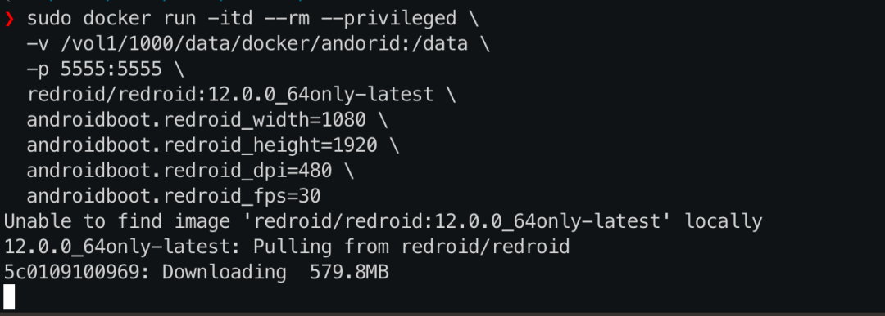
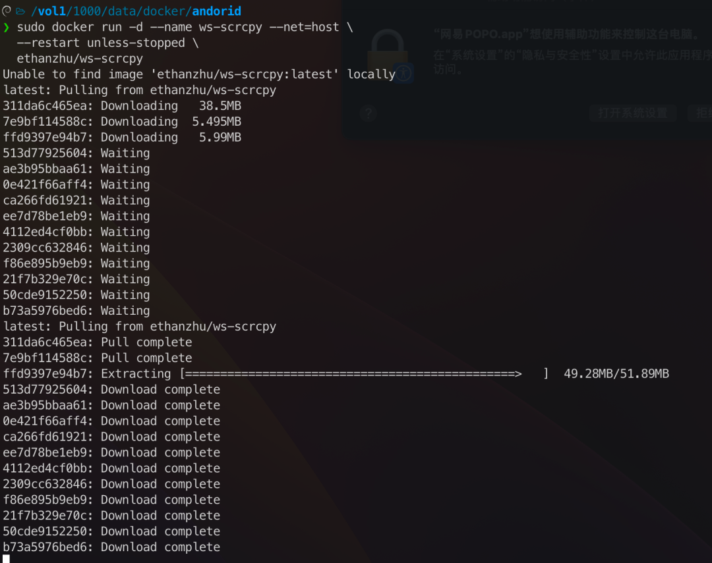
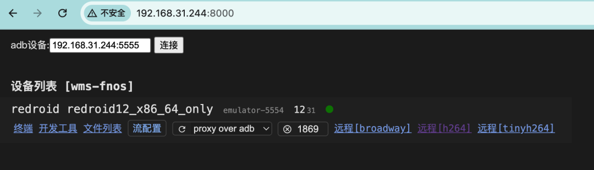
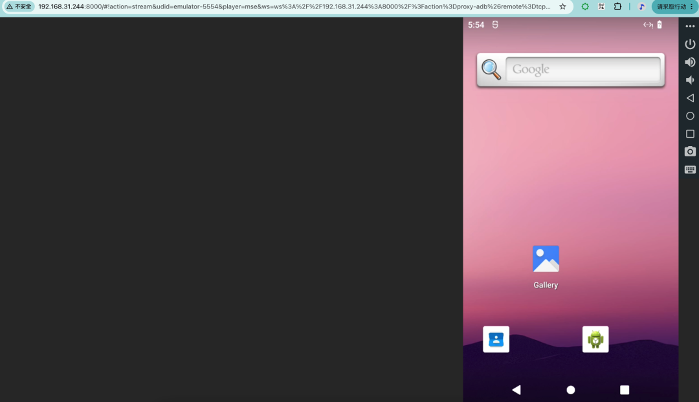
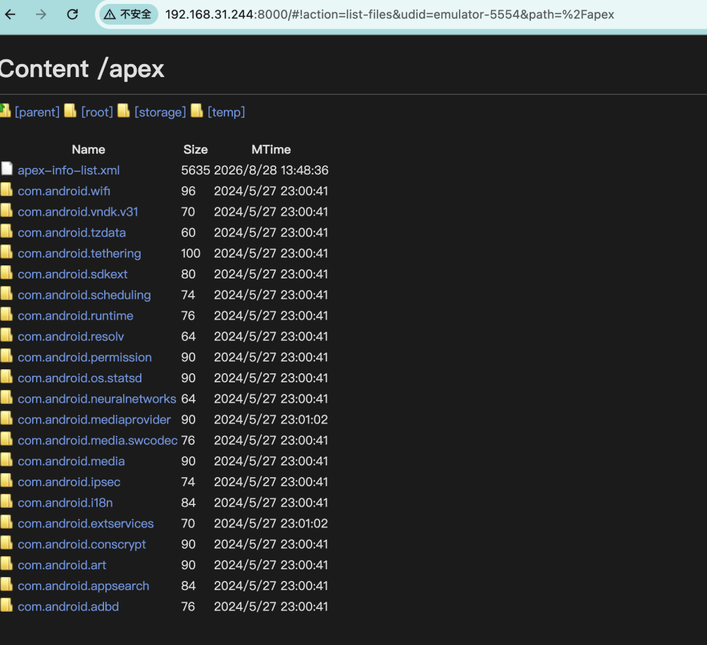
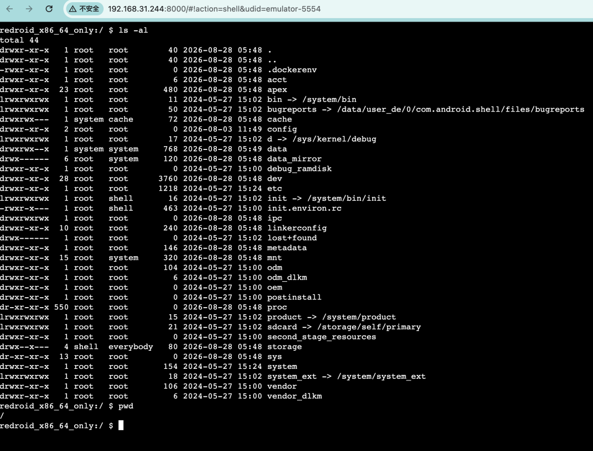

# 手机为了挂机App天天耗电发热？NAS上跑个Android，签到自动化一条命令搞定

> ✍️ **作者:** 飘落的数码折腾日记  
> 📅 **发布时间:** 2026/9/3 20:00:00  
> 🔗 **微信原文:** https://mp.weixin.qq.com/s/lRgKaeQC_zzji0_Qt7gu1w  
> 📦 **本地图片数:** 6 张 (已物理转存至本地 images/ 目录)

---

我的手机里有个 App，每天晚上都要签到领积分。以前都是睡前点一下，有时候忘了就断签，第二天看着提醒心里那个难受。后来想搞个自动化脚本挂着，但手机跑脚本耗电又发热，总不能为这个专门买台手机吧？

转念一想——NAS 不是 24 小时开机的吗？能不能让 NAS 帮我跑 Android App？

一开始以为要在 NAS 上装 Android 模拟器，试了一圈发现，传统的模拟器太重了，而且需要图形界面，NAS 上根本跑不起来。后来找到了一个叫 Redroid（Remote Android）的开源项目，它能直接在 Docker 里运行完整的 Android 系统，不需要硬件虚拟化。NAS 上一条 docker run 命令，一个 Android 系统就起来了。

## 它到底是个什么玩意？

Redroid（GitHub 6.7K stars，Apache 2.0 协议）是一个把 Android 系统容器化的开源项目。它的原理很简单：把 Android 的用户空间直接跑在宿主 Linux 内核上，通过 binder 和 ashmem 内核模块实现 Android 特有的进程间通信和内存管理。

最关键的——**它不需要 KVM 硬件虚拟化**。传统的 Android 模拟器（比如 MuMu 模拟器、雷电模拟器、夜神模拟器，或者 Android Studio 自带那个）都需要 CPU 支持硬件虚拟化，云服务器（已虚拟化一层)恰恰没有这个条件。这也是为什么那些模拟器只能在电脑上跑，而 Redroid 可以跑在 NAS、云服务器上，不需要显卡、不需要显示器，一条命令后台就能跑起来。

支持的 Android 版本从 8.1 到最新的 Android 16 都可以选，arm64 和 amd64 两种架构都支持。镜像压缩后 600MB 上下（不同版本略有差异），解压开是一个完整 Android 系统，比很多人手机里装的 App 加起来还大。

## 折腾了几天，我发现了它最实用的几个场景

## 1. 24 小时在线挂机，手机终于解放了

最直接的用途。自动化签到、定时任务、后台运行脚本——这些以前需要手机一直开着的活儿，现在全交给 NAS 里的 Android 容器。NAS 本身 24 小时开机，多跑一个 Android 容器跟多跑一个普通 Docker 容器差不多，电费几乎零增加。手机该充电充电，该睡觉睡觉，挂机的事交给 NAS。

## 2. 跑那些只有 Android 版的 App

有些工具只有 Android 版，没有网页版，也没有 iOS 版。以前只能在手机上用，手机一离手就用不了。现在 NAS 上跑个 Android 容器，App 装进去，用浏览器远程操作，App 更新了容器里照常更新，跟真机一样。

## 3. 自动化测试，挂了不心疼

跑 UI 自动化测试、批量截图、App 兼容性测试——以前用真机跑，屏幕一直亮着，电池循环刷刷掉。容器里跑测试，挂了直接重启镜像，数据在挂载卷里完好无损，比折腾真机省心一百倍。

这种用法其实在**企业里早就这么干了**——云游戏、App 测试农场、手机虚拟化，背后跑的正是 Redroid 这套方案。只不过企业用 Kubernetes 集群管理成百上千个实例，NAS 上跑一个容器玩玩，原理是一样的。

## 部署步骤：拉镜像、启动容器

Redroid 的部署核心就两步：拉镜像、启动容器。内核特性大部分现代系统已经内置，按需排查就行。

## 第一步：确认内核特性

Redroid 运行需要两个内核特性：binder（Android 进程间通信）和 ashmem/memfd（共享内存）。

好消息是——**大部分现代 Linux 发行版已经把这两个特性内置进内核了**，飞牛 OS 的 6.18 内核、Ubuntu 22.04+、Debian 12 都是如此，直接启动容器就能跑，不需要手动加载任何模块。

可以先不管内核，直接跳到第二步启动容器。如果容器启动后马上退出（秒退），再回来查这步。

**怎么判断是不是内核特性的问题：**

# 看容器退出日志
docker logs &lt;容器名&gt;
# 看内核日志里有没有binder/ashmem相关报错
dmesg -T | grep -iE "binder|ashmem"

如果日志提示找不到&nbsp;/dev/binder&nbsp;之类，说明当前内核没开这两个特性，需要处理：

# Ubuntu/Debian：binder编译成了模块，需要手动加载
sudo apt install linux-modules-extra-$(uname -r)
sudo modprobe binder_linux devices="binder,hwbinder,vndbinder"
# ashmem在新内核(5.18+)已移除，redroid改用memfd，这条只在老内核上需要
sudo modprobe ashmem_linux

想让模块开机自动加载，把 modprobe 命令加到开机脚本里，或者在/etc/modules 里添加 binder_linux。

**如果你的 NAS 是飞牛 OS**：6.18 内核已内置 binderfs 和 memfd，不用加载任何模块，直接启动容器就行。

## 第二步：启动 Android 容器

docker run -itd --rm --privileged \
&nbsp; --pull always \
&nbsp; -v /opt/android-data:/data \
&nbsp; -p 5555:5555 \
&nbsp; redroid/redroid:12.0.0_64only-latest

参数解释：--privileged
：必需。容器需要访问 binder/ashmem 这些内核设备-v /opt/android-data:/data
：数据持久化。装了 App、登录了账号，重启容器后都在-p 5555:5555
：调试端口，用于连接 Android 容器（后续通过浏览器界面操作不需要直接操作这个端口，但容器需要暴露它）redroid/redroid:12.0.0_64only-latest
：Android 12 64 位版，稳定性和兼容性都经过了充分验证

**⚠️ 安全提醒**：5555 端口不要映射到公网，只在内网使用。

## 第三步：设置显示参数

启动容器时可以指定分辨率，让投屏画面更清晰：

docker run -itd --rm --privileged \
&nbsp; -v /opt/android-data:/data \
&nbsp; -p 5555:5555 \
&nbsp; redroid/redroid:12.0.0_64only-latest \
&nbsp; androidboot.redroid_width=1080 \
&nbsp; androidboot.redroid_height=1920 \
&nbsp; androidboot.redroid_dpi=480 \
&nbsp; androidboot.redroid_fps=30

## 操作容器里的 Android，两种方式

容器里的 Android 没有屏幕，怎么操作？

## 方式一：scrcpy 投屏到电脑

scrcpy 是一个开源投屏工具（GitHub 116K stars），在电脑上装好后，一条命令就能把 Android 容器的画面投到电脑上，支持鼠标操作和键盘输入，跟在手机上操作没什么区别。

# 电脑上装scrcpy后，连到NAS上的Android容器
scrcpy -s 你的NAS内网IP:5555

连上之后，电脑上会弹出一个窗口，显示 Android 的桌面，点按、滑动、输入文字，跟操作真机一样。

## 方式二：浏览器 Web 界面（最方便，不用装任何软件）

想在浏览器里直接操作 Android 容器，可以用 ws-scrcpy 这个项目。它把 scrcpy 的投屏、文件管理、App 安装全部搬到浏览器里，不需要在电脑上装任何软件，打开浏览器就能看到 Android 桌面并操作。

ws-scrcpy 的原项目（NetrisTV/ws-scrcpy）已经停更多年，Docker Hub 上也没有官方镜像。目前维护活跃、能直接拉镜像的 fork 是 ethanzhu/ws-scrcpy（439MB，支持 amd64），国内还有阿里云镜像加速。

**用 Docker 部署 ws-scrcpy：**

docker run -d --name ws-scrcpy --net=host \
&nbsp; --restart unless-stopped \
&nbsp; ethanzhu/ws-scrcpy

用&nbsp;--net=host&nbsp;是因为 ws-scrcpy 需要通过 ADB 连接宿主机上的 Redroid 容器（5555 端口），host 网络模式能自动发现宿主机设备，省去额外配置。启动后在浏览器里打开&nbsp;http://你的 NAS 内网 IP:8000，就能看到 Web 界面。

如果&nbsp;--net=host&nbsp;不方便用（比如端口冲突），也可以用端口映射的方式，但需要手动让 ws-scrcpy 容器去连 Redroid：

docker run -d --name ws-scrcpy \
&nbsp; -p 8000:8000 \
&nbsp; --restart unless-stopped \
&nbsp; ethanzhu/ws-scrcpy
# 让 ws-scrcpy 容器连接宿主机上的 Redroid
docker exec ws-scrcpy adb connect 你的NAS内网IP:5555

连上之后，Android 桌面就出现在浏览器里了。点按、滑动、装 App、传文件，全部在浏览器里完成。

**装 App 的方法**：在 Web 界面的文件管理功能里上传 APK 文件，点击安装，跟手机上装 App 一样简单。

ws-scrcpy 还内置了 ADB Shell 终端，不用另开命令行，直接在浏览器里就能敲 adb 命令调试容器。

## 自动签到怎么搞？

Redroid 容器跑起来之后，最核心的问题就是：怎么让 App 自动签到、自动完成任务？

**方法一：App 自带的定时任务**

很多 App 本身就支持定时签到或自动领取。先把 App 装好、登录账号，在 App 的设置里找到「定时签到」「每日奖励」之类的选项打开就行。这是最省心的方式，不需要额外折腾。

**方法二：在 Android 容器里装 Tasker 自动化**

Tasker 是一款 Android 端的自动化工具，直接在容器里安装，然后配置定时触发任务。可以设置每天固定时间打开某个 App、点击指定位置、等待几秒、再返回。配置好了之后，即使电脑关了，Android 容器里的 Tasker 也会按计划执行。

**方法三：Auto.js 脚本（适合复杂操作）**

Auto.js 是一个 Android 端的 JavaScript 自动化工具，可以写脚本实现更复杂的自动操作——识别屏幕上的文字、判断界面状态、条件分支等。在 Android 容器里装 Auto.js，写一个签到脚本，设置定时执行。

**我推荐的做法**：先看 App 本身有没有定时签到功能，有的话直接开。没有的话，在容器里装 Tasker 配置定时任务，最稳定也最省心。

## 配置要求高吗？

NAS 跑 Android 容器，配置要求其实不高，大部分主流 NAS 都能满足：
配置项
最低要求
推荐配置
CPU
双核，x86_64 或 arm64
四核以上
内存
2GB
4GB 以上（挂多个 App 时更从容）
存储
10GB（系统镜像+数据）
32GB 以上
内核
Linux 5.10+，支持 binder/ashmem
同左

我的 NAS 是飞牛 OS，内核 6.18，直接加载 binder 模块就能用，没有遇到兼容性问题。Linux 内核的 NAS 系统理论上都可以——群晖 DSM、威联通 QTS、Unraid 等系统只要内核打开了 binder 相关选项，都能跑。

## 踩坑记录

**问题 1：容器启动后马上就退出了**

大概率是内核模块没加载。运行dmesg -T | tail -30看日志，如果提示 binder、ashmem 相关错误，确认 modprobe 命令没报错，重启后再试。

**问题 2：Web 界面连不上容器**

ws-scrcpy 需要通过 ADB 连接 Redroid 容器的 5555 端口。用&nbsp;--net=host&nbsp;启动的话会自动发现宿主机设备；如果用端口映射（-p 8000:8000），需要手动执行&nbsp;docker exec ws-scrcpy adb connect 你的 NAS 内网 IP:5555&nbsp;让容器去连 Redroid。

**问题 3：App 市场怎么装？**

Redroid 默认不带 Google Play 服务。装国内 App 的话，去酷安官网下载 APK 文件，通过 ws-scrcpy 的 Web 界面上传安装就行。如果需要 Google Play，可以编译带 GMS 的镜像，官方文档里有步骤。

**问题 4：装完 App 后怎么保存数据？**

启动容器时挂载了-v /opt/android-data:/data，App 数据就保存在 NAS 的/opt/android-data目录里。容器删了重建，数据还在。没挂载的话，容器删了数据就没了。

**问题 5：GPU 加速要开吗？**

Redroid 默认用软件渲染（gpu_mode=guest），日常用 App、刷界面完全够用。如果 NAS 有独立显卡或集成显卡，可以设置androidboot.redroid_gpu_mode=host开启 GPU 加速，游戏和图形渲染会更流畅。

## 什么时候不建议用？

虽然 Redroid 很好用，但也不是万能的：**需要 Google Play 服务**
：默认不带 GMS，需要额外编译镜像，有一定门槛**需要硬件传感器**
：陀螺仪、GPS、NFC 等硬件传感器容器里没有，依赖这些传感器的 App 用不了**需要打电话/发短信**
：没有 SIM 卡模块，电话和短信功能不可用**高强度游戏**
：容器里跑游戏可以，但如果没有 GPU 加速，3D 游戏体验一般

## 还能当平板用

前面挂机讲得比较多，其实 Redroid 不止能跑签到脚本。启动时把分辨率和 DPI 改成平板规格，它就是一台平板——没有单独的平板镜像，改的就是这几个参数：

docker run -itd --rm --privileged \
&nbsp; -v /opt/android-data:/data \
&nbsp; -p 5555:5555 \
&nbsp; redroid/redroid:12.0.0_64only-latest \
&nbsp; androidboot.redroid_width=1920 \
&nbsp; androidboot.redroid_height=1200 \
&nbsp; androidboot.redroid_dpi=240 \
&nbsp; androidboot.redroid_fps=30

横屏 1920×1200、DPI 降到 240，投屏出来就是平板界面，画布大了一截，操作微信这类 App 比手机竖屏顺手得多。

## 写在最后

在 NAS 上跑 Android 容器这件事，折腾之前觉得是「没必要」，折腾完觉得「真香」。NAS 本来就是 24 小时开机的，放个 Android 容器在里面，相当于是把手机该干的活搬到 NAS 上了——自动化脚本、挂机任务、App 操作，全都交给 NAS，手机解放出来。

而且 Docker 容器的好处大家都知道：挂了就重启，系统坏了重新拉一个镜像，数据在挂载的卷里完好无损。比折腾真机省心多了。

大家 NAS 上都在跑什么有意思的容器？有没有试过其他 Android 容器方案？欢迎在评论区聊聊。

觉得有用的话点个关注，后续还会继续分享 NAS 的各种实用玩法。

