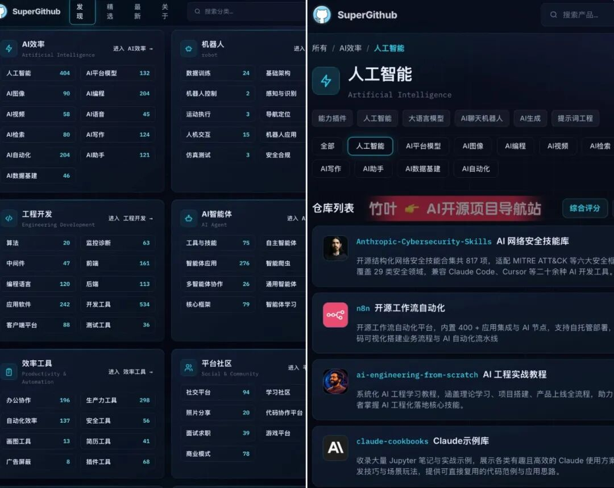
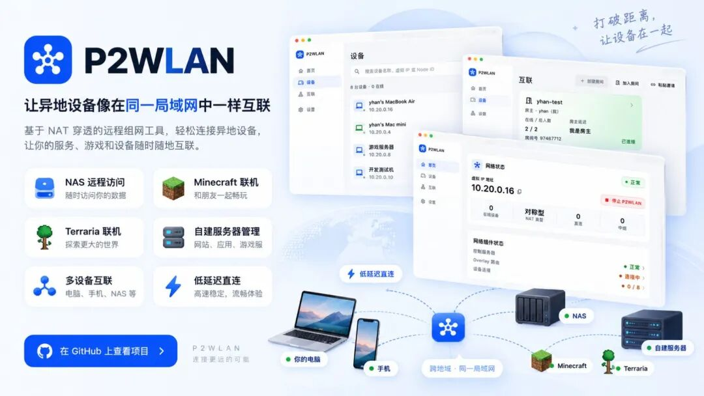
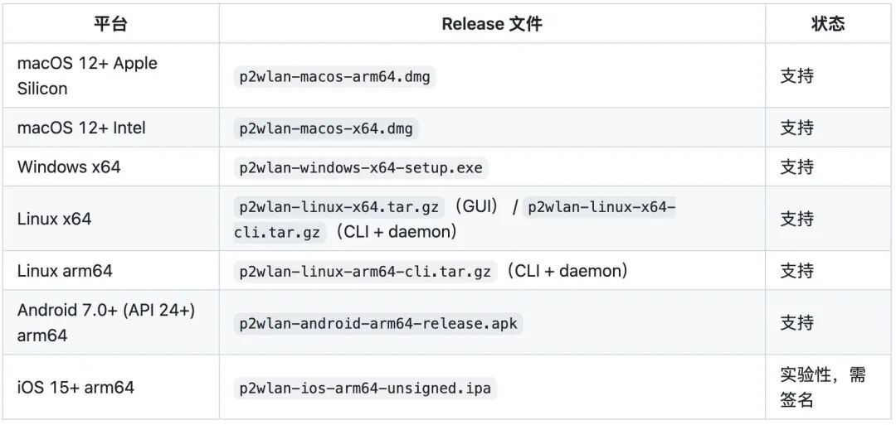
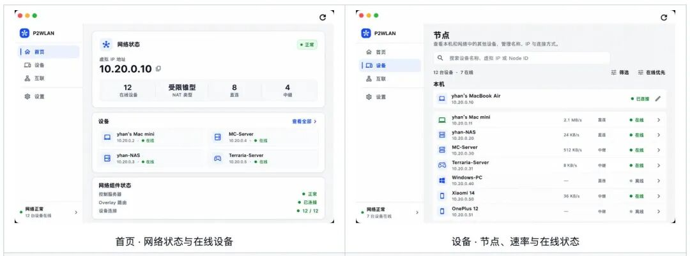
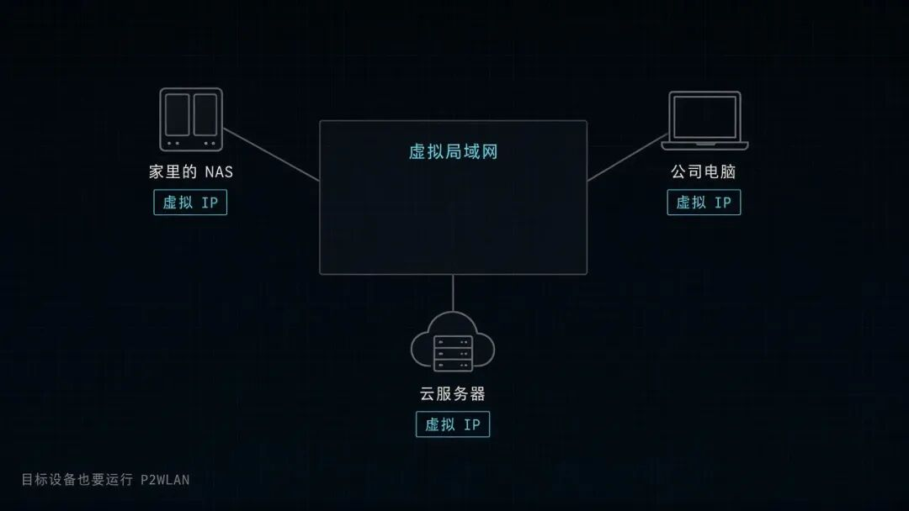
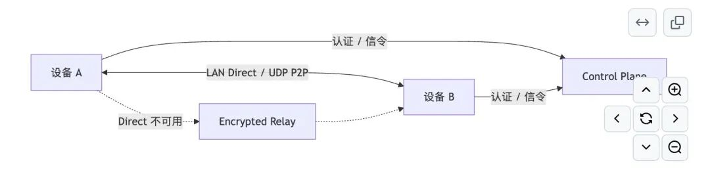
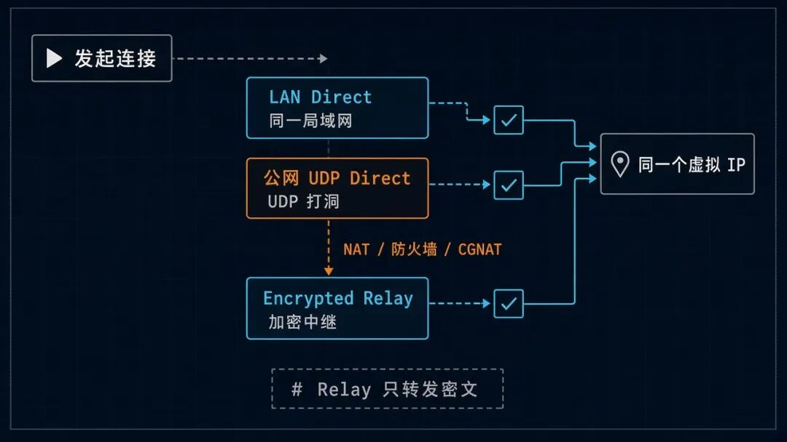
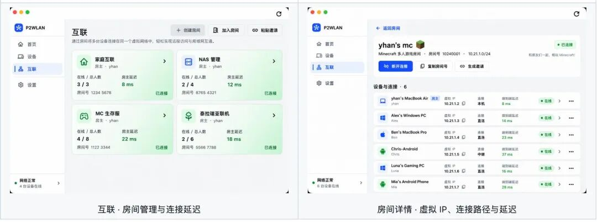
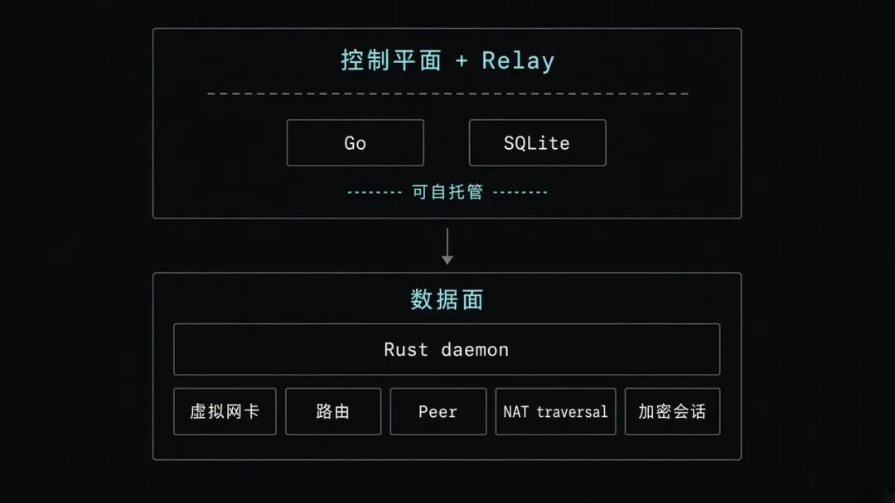

# 牛逼，GitHub上面有人搞了个虚拟局域网，异地电脑秒变同个路由器直连。

> ✍️ **作者:** 沐言Agent  
> 📅 **发布时间:** 2026/10/2 07:20:00  
> 🔗 **微信原文:** https://mp.weixin.qq.com/s/Ijhiv5lRkxuxha-1p-vrZw  
> 📦 **本地图片数:** 9 张 (已物理转存至本地 images/ 目录)

---

还记得十多年前，我自己做了个小网站，想让朋友访问，但又不想花钱租服务器，因为比较贵。

后来找了一个叫花生壳的工具，可以实现网络穿透，不用租服务器只花少量的钱也可以实现，缺点就是带宽很有限。

相信不太朋友可能也会有类似的需求：

想让家里的设备，公司设备，甚至是云服务器设备，可以互相访问，要想解决这个问题要处理端口转发、动态域名和路由规则。光把这几台设备连起来，就够折腾一阵了。

今天给大家推荐一个开源项目，叫&nbsp;**P2WLAN**。

它在 GitHub 上已经拿到&nbsp;**1.4k 星**，它可以让在不同网络设备，像在同一个局域网下相互访问，不需要你租服务器或者花生壳这样的工具。

## 不用给每台设备单独暴露公网端口

P2WLAN 是一个跨平台的 P2P 虚拟局域网工具，支持 Windows、macOS、Linux 和 Android，iOS 版本目前还在实验阶段。

每台设备安装客户端后，都会获得一个虚拟 IP。之后访问 NAS、SSH、RDP、数据库或 Web 面板，直接使用对方的虚拟 IP 就可以，不用再给每台设备单独配置公网端口。

它适合用来远程访问家里的 NAS 和 HomeLab，也可以让不同地方的朋友一起玩 Minecraft、Terraria。开发者还可以把不同地区的开发机、测试机和云主机连起来，访问一些只打算放在私网里的服务。

有一点需要提前说清楚：安装 P2WLAN 后，家庭网络里的其他设备不会自动加入这个虚拟网络。想要互相访问的目标设备，也需要安装并运行 P2WLAN。

## 直连优先，失败了自动走 Relay

P2WLAN 的连接策略可以简单理解成三步：

LAN Direct → 公网 UDP Direct → Encrypted Relay

如果两台设备在同一个局域网里，优先走本地直连。

如果分处不同网络，项目会尝试 UDP 打洞，让两台设备建立公网 P2P 连接。

遇到复杂 NAT、防火墙、CGNAT 或云安全组，直连不一定能成功，这时会自动回退到加密 Relay。

也就是说，业务侧使用的始终是同一个虚拟 IP，底层到底走直连还是中继，可以在客户端里看到。

Relay 只负责转发密文，不负责解密业务数据，但它仍然可能看到节点标识、连接时间和数据包大小等元数据。

## 房间组网，把“我要和谁互联”单独管理

P2WLAN 里有一个比较实用的设计叫&nbsp;**Rooms**。

你可以创建一个房间，把朋友、家里的设备，或者一组开发测试机器放进去。

比如单独建一个 Minecraft 房间，大家加入之后，就能查看成员在线状态、虚拟 IP、当前连接路径和延迟。

也可以为 NAS 维护设备创建一个固定房间，不用把所有设备混在同一张列表里。

项目还提供 GUI、CLI 和 daemon，既可以在桌面端操作，也可以放到没有桌面的 Linux 服务器上运行。

控制平面和 Relay 支持自托管，服务端使用 Go 和 SQLite，数据面则由 Rust daemon 负责虚拟网卡、路由、Peer、NAT traversal 和加密会话。

对想自己掌控网络入口的人来说，这一点比单纯下载一个客户端更有价值。

但这里也要说清楚，P2WLAN 当前仍处于 Preview 阶段，项目还没有完成独立安全审计，也不是官方 WireGuard 实现，不声明 WireGuard 互操作兼容。

如果是朋友联机、远程开发、家庭实验室和自托管测试，值得先跑起来体验一下。

仓库地址：

1

https://github.com/yhan-sun/p2wlan

