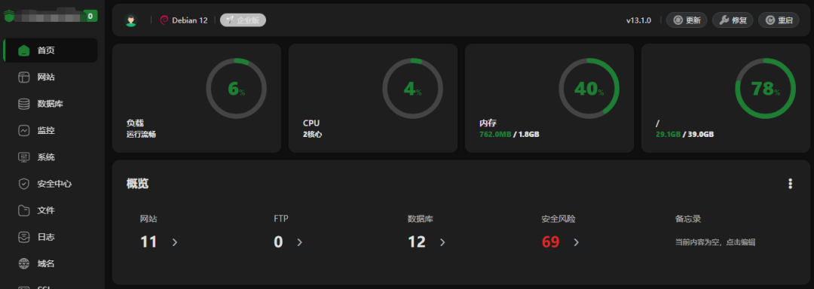
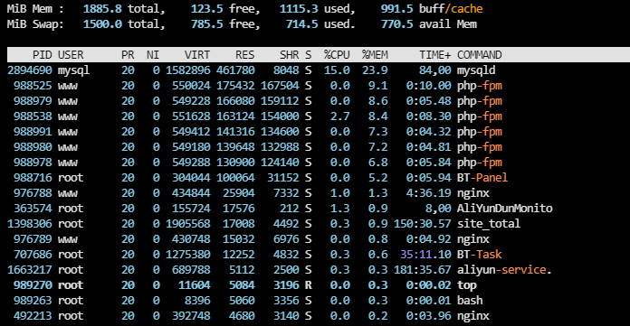
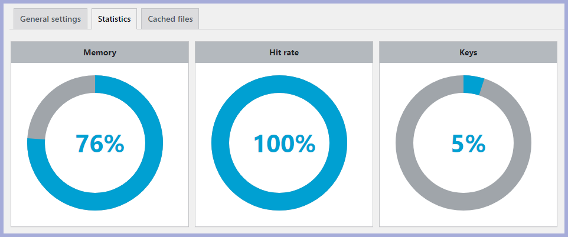
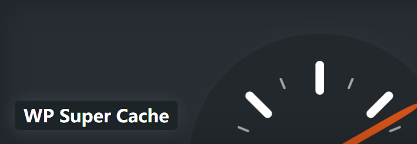

# 这款99元1年，续费不涨价的服务器，我发现很多人严重低估了它的实力

> ✍️ **作者:** CLOUD  
> 📅 **发布时间:** 2026/10/4 10:06:33  
> 🔗 **微信原文:** https://mp.weixin.qq.com/s/PZt3qlaqextfGT_WCs3mCg  
> 📦 **本地图片数:** 5 张 (已物理转存至本地 images/ 目录)

---

2G内存不大，但会用的人，能把它用出花来。

阿里云99计划那款ECS，**2核2G3M**，我前几年就买了。

续费了好几次，每次都是99元。活动又延期到**2029年3月**，看来还能再用几年。

现在买，买完马上续费1次，明年后年还能再续2次。**大概能用4年，每年都是99元。**

99计划专属页：https://t.aliyun.com/U/uDcdi2

## 它的实力，被“2核2G”这四个字掩盖了

很多人一看配置：2核2G。

然后就划走了。

但你仔细看它的完整参数：

**3Mbps固定带宽，不限流量。独立公网IP。续费同价。不限新老用户。ECS弹性云服务器，可升级扩展。**

这些加起来，才是它真正的实力。

2G内存放在今天，确实不大。比起那些256GB内存的机器，微不足道，但是也有很多人依然在使用512MB内存的服务器的。

但它的定位本来就是**入门级**。日常开发、测试、学习，覆盖大部分需求没问题。

## 我拿它跑了什么

这台机器我用了好几年。

装的是**宝塔面板**，搭的**LNMP环境**，跑着**好几个WordPress网站**。

真实访客其实不多，1天估计就几百。

但**蜘蛛爬虫是真的多**。尤其是现在各种大模型的爬虫，数万甚至数十万的访问量。

**所以不优化，内存和CPU照样扛不住。**

## 基础优化做完，它就能轻松跑起来

**第一，开启Swap。**

这可能会损失一点性能，但**必要性非常大**。2G物理内存，加上Swap，等于给系统加了层保险，防止内存突然打满直接崩。

**第二，关闭Kdump。**

Kdump会预留一部分内存做内核崩溃转储。对个人小站来说，这个功能用不上，**关掉能释放出被预留的内存**。

**第三，数据库和缓存层面做优化。**

用&nbsp;**Redis**&nbsp;缓存数据，减少数据库查询。PHP开启&nbsp;**OPcache**，把编译好的脚本缓存起来，不用每次重新编译。

**第四，用WP Super Cache插件。**

把页面生成静态HTML缓存起来。访客访问时直接读缓存，不走PHP和数据库，**内存和CPU压力大幅下降**。

**第五，屏蔽垃圾蜘蛛和爬虫。**

这是被很多人忽略的一招。那些没有意义的爬虫，不带来流量，只消耗资源。在Nginx配置里加屏蔽规则，**能砍掉一大半无效访问**。

## 总结

**99元1年，续费不涨价，能用4年。**

这个价格，买到的是独立公网IP、不限流量、ECS弹性架构。

2核2G确实不大。但**做好优化，它能跑的东西比你想的多。**

Swap、关Kdump、Redis、OPcache、页面缓存、屏蔽爬虫。

这几招做完，这台99元的服务器，能稳稳地跑好几年。

**别被配置数字骗了。会用，才能榨干它的性价比。**
服务器地址：
https://t.aliyun.com/U/T0RY8t

