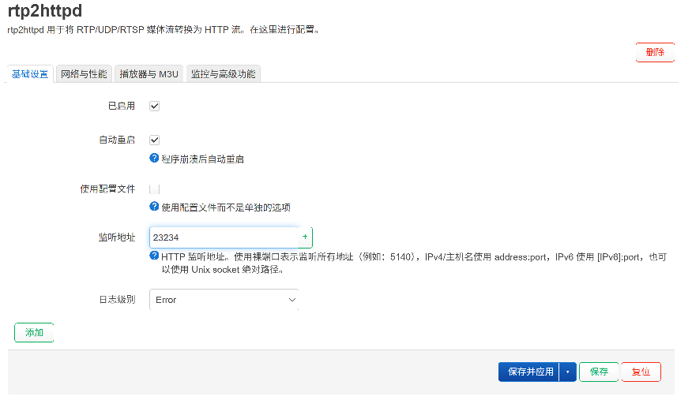
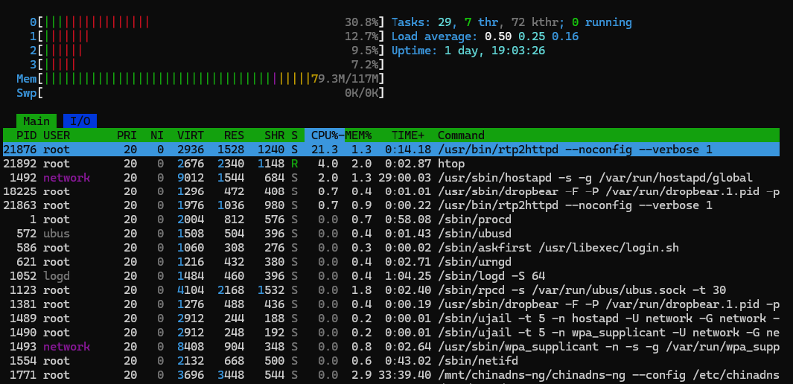
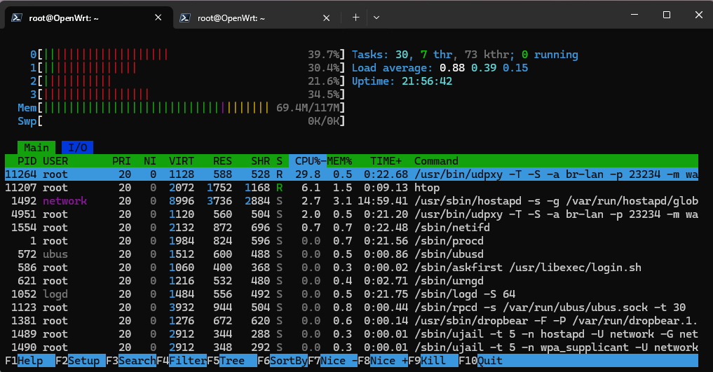

# 用 rtp2httpd 转发宽带运营商 IPTV 组播

> ✍️ **作者:** 白一梓  
> 📅 **发布时间:** 2026/10/4 20:08:48  
> 🔗 **微信原文:** https://mp.weixin.qq.com/s/5NMVUt8yGiBGdUeaEC6jZw  
> 📦 **本地图片数:** 3 张 (已物理转存至本地 images/ 目录)

---

&nbsp;

## 用 rtp2httpd 转发宽带运营商 IPTV 组播

前些天发表《在安卓机顶盒中看宽带运营商 IPTV》&nbsp;时提到运营商组播代理工具用的是 udpxy，但是部分网友说使用 rtp2httpd 性能更好。所以我又实地测试了一下 rtp2httpd 这款组播转单播软件。

rtp2httpd 官方文档中说其已经上架了若干家 openwrt 的变种操作系统的应用商店，其中就包括我用的 ImmortalWrt，但是实测发现在我的设备上找不到安装包，估计是由于我用的版本过低（23 版本）。所以还是用官方提供的安装脚本来一键安装：

uclient-fetch -q -O - https://raw.githubusercontent.com/stackia/rtp2httpd/main/scripts/install-openwrt.sh | sh

安装完成后，它是自带 openwrt 管理 UI的，在 openwrt 的&nbsp;**服务**&nbsp;菜单中能找到&nbsp;**rtp2httpd**&nbsp;的子菜单，点开&nbsp;**基础设置**&nbsp;的标签页，将&nbsp;**已启用**&nbsp;的复选框选中，顺便勾选上&nbsp;**自动重启**（程序崩溃后自动重启）。**监听地址**&nbsp;默认是&nbsp;5140，这里改成我们项目中生成的 m3u 文件所用的&nbsp;23234，这样项目中的 m3u 文件可以直接用。

rtp2httpd 基础设置

配置完成后点击按钮&nbsp;**保存并应用**，等待其生效。生效后，就可以做测试了，我找了一个 4K 视频，跟 udpxy 做对比，CPU 占用果然要低。

**rtp2httpd 运行时：**

rtp2httpd 运行 htop

**udpxy 运行时：**

udpxy 运行 htop

从这两张截图可以读到：

指标
rtp2httpd
udpxy
进程自身 CPU 占用
约&nbsp;**21.3%**
约&nbsp;**29.8%**
CPU0 占用
约&nbsp;**30.8%**
约&nbsp;**39.7%**
Load Average（1/5/15 分钟）
0.50 / 0.25 / 0.16
0.88 / 0.39 / 0.15

&nbsp;

