# 没有公网IP，也能远程看家里的IPTV：Cloudflare Tunnel实现组播转单播内网穿透

> ✍️ **作者:** 网络志  
> 📅 **发布时间:** 2026/8/21 16:00:00  
> 🔗 **微信原文:** https://mp.weixin.qq.com/s/nexVC9Nxr9JC8BuzjqXTXw  
> 📦 **本地图片数:** 35 张 (已物理转存至本地 images/ 目录)

---


📺前言

之前我们专门介绍过如何利用 rtp2httpd 将家庭 IPTV 的 **RTP/UDP 组播转换成 HTTP 单播**，让原本只能在家庭局域网中观看的 IPTV，可以被普通播放器访问。

👉 参考前文：

**一款比 udpxy、msd_lite 更强大的 IPTV 组播转单播神器 —— rtp2httpd**

**湖南电信OpenWrt 拨号 IPTV 全流程教程 | 内网融合组播转单播 + 单播回看全搞定**

这次继续往后折腾。

如果家里的 IPTV 已经可以通过 rtp2httpd 正常播放，那么有没有办法在**没有公网 IPv4、无法做端口映射**的情况下，通过一个公网域名，从外面访问家里的 IPTV？

答案就是：

☁️ **Cloudflare Tunnel + rtp2httpd**

而且这个玩法并不局限于 IPTV。

只要是家庭局域网里可以通过 HTTP/HTTPS 访问的服务，例如：
📺 rtp2httpd
📡 TVGate
🛠️ 1Panel
🖥️ NAS Web 管理页面
🏠 php环境 Web 服务
📊 各种自建 Web 服务

理论上都可以通过 Cloudflare Tunnel 建立公网访问入口。

所以本文真正想介绍的，其实是：

**利用一台内网设备运行 Cloudflare Tunnel，把整个家庭局域网中的 Web 服务“接入”公网。**

而 IPTV，只是其中一个非常有意思的应用场景。

注意：需要注册一个cloudflare账号，并且把域名托管进来。


一、先看看本文的实际网络环境 🏠

为了避免后面的 IP 地址看起来比较抽象，先把本文实际使用的家庭网络环境交代清楚。

本次测试环境如下：

```
                    家庭局域网
                         │
              ┌──────────┴──────────┐
              │                     │
            路由器                 N1 盒子
          192.168.0.1           192.168.0.203
              │                     │
              │                  Docker
              │                     │
              │                cloudflared
          rtp2httpd
              │
       IPTV 组播 → HTTP
```

这里有两个非常关键的设备：

## 📺 路由器：192.168.0.1

路由器本身已经完成 IPTV 相关配置，并在上面运行：

```
rtp2httpd
```

也就是说：

```
IPTV 组播
    ↓
路由器
192.168.0.1
    ↓
rtp2httpd
    ↓
HTTP
```

具体 rtp2httpd 如何安装和配置，可以直接参考之前的文章，这里不再重复。

## 🐳 N1：192.168.0.203

另外有一台 N1 盒子，IP 地址：

```
192.168.0.203
```

N1 上运行 Docker，并部署：

```
cloudflared
```

也就是说，本文的 Cloudflare Tunnel **并不是运行在路由器上，而是运行在 N1 上。**

因为两台设备都在同一个家庭局域网中，所以 N1 上的 cloudflared 可以直接访问：

```
http://192.168.0.1:xxxx
```

这样的内网服务。


二、为什么 Tunnel 不需要部署在 IPTV 路由器上？🤔

这也是这个方案比较有意思的地方。

很多人可能会想：

rtp2httpd 都运行在 192.168.0.1 上了，是不是 cloudflared 也必须安装在路由器上？

其实完全不需要。

Cloudflare Tunnel 的本质是：

```
cloudflared
    ↓
访问某个内网服务
```

只要运行 cloudflared 的设备能够访问目标服务即可。

从某种角度来说，把 cloudflared 单独放在 N1 上反而更加方便。

因为路由器负责：

```
🌐 路由
📺 IPTV
📡 IGMP
```

N1 负责：

```
🐳 Docker
☁️ Cloudflare Tunnel
🛠️ 其他服务
```

各司其职。


三、Cloudflare Tunnel真正解决的是什么？☁️

传统的内网穿透思路通常是：

```
公网
  ↓
公网IP
  ↓
路由器端口映射
  ↓
192.168.0.x
  ↓
内网服务
```

但很多家庭宽带没有公网 IPv4，或者处于 CGNAT 后面。

这时候端口映射就比较尴尬。

Cloudflare Tunnel 则反过来：

```
家庭网络
    │
    │ 主动连接
    ▼
cloudflared
    │
    ▼
Cloudflare ☁️
```

然后外部用户访问：

```
https://tv.example.com
```

Cloudflare 再通过已经建立的 Tunnel，把请求转回：

```
192.168.0.1
```

上的服务。

所以：

**家庭路由器不需要专门开放一个公网入站端口。**


四、开始部署--先在 Cloudflare 创建 Tunnel ☁️

在 N1 上部署 cloudflared 之前，需要先在 Cloudflare 后台创建一个 Tunnel。

整个过程可以简单理解为：

```
Cloudflare 后台
      ↓
创建 Tunnel
      ↓
获得 Tunnel Token
      ↓
N1 Docker 部署 cloudflared
      ↓
连接到刚刚创建的 Tunnel
```

## 1️⃣ 登录 Cloudflare

首先登录自己的 Cloudflare 账户，进入对应域名所在的 Cloudflare 控制台。

进入 **Zero Trust** 管理界面（首次进入可能需要绑定支付方式验证身份，但创建隧道本身是免费的）。

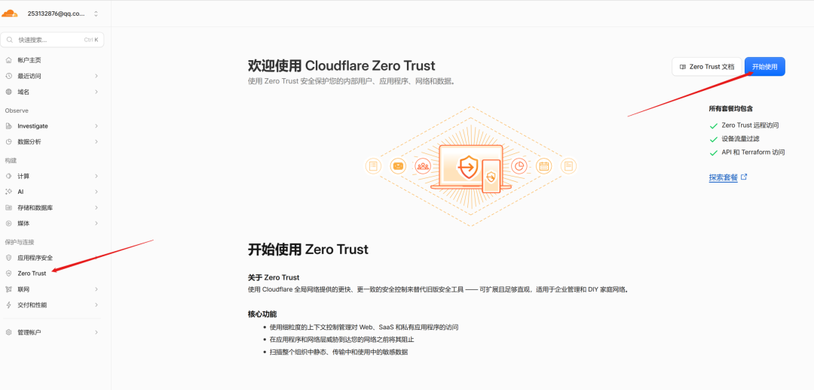

然后找到：

```
Networks（网络）
  ↓
Tunnels（连接器）
```

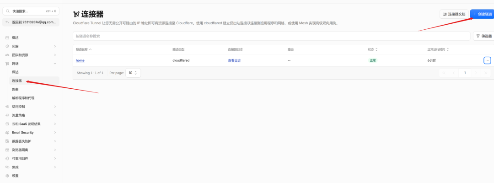

## 2️⃣ 创建一个新的 Tunnel 🚇

点击：

```
创建隧道
```

然后选择使用：

```
Cloudflared
```

作为 Tunnel 类型。

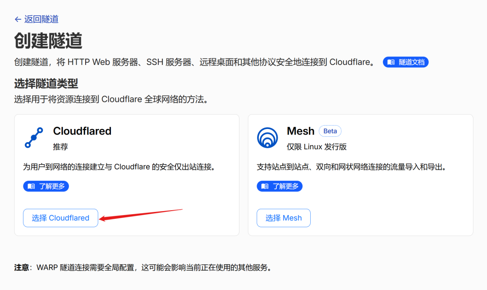

接下来给 Tunnel 起一个名字。

例如：

```
home
```

或者：

```
home-server
```

名字主要用于自己管理和区分不同 Tunnel，并不会直接影响后面的公网域名。

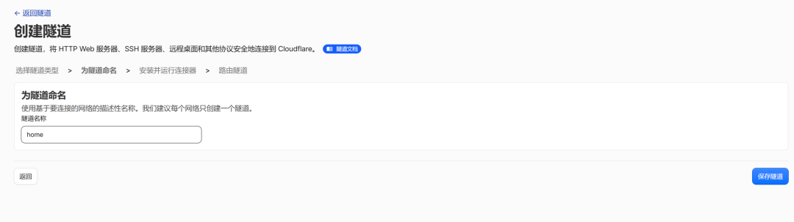

如果这个 Tunnel 不只是用于 IPTV，而是准备同时连接：
📺 rtp2httpd
📡 TVGate
🛠️ 1Panel
🖥️ NAS
🏠 其他 HomeLab 服务

那么更推荐使用：

```
home-server
```

这样的名称，而不是：

```
iptv
```

因为以后可以继续往里面添加其他内网服务。

## 3️⃣ 获取 Tunnel Token 🔑

Tunnel 创建完成后，Cloudflare 会让你选择安装并运行连接器。

Cloudflare 会根据你的系统提供对应的安装命令。

本文使用的是：

🐳 **Docker**

所以后面直接在 N1 上使用 Docker 运行 cloudflared 即可。

Cloudflare 随后会提供类似这样的运行命令：

```
cloudflared tunnel --no-autoupdate run --token eyJhIjoi...
```

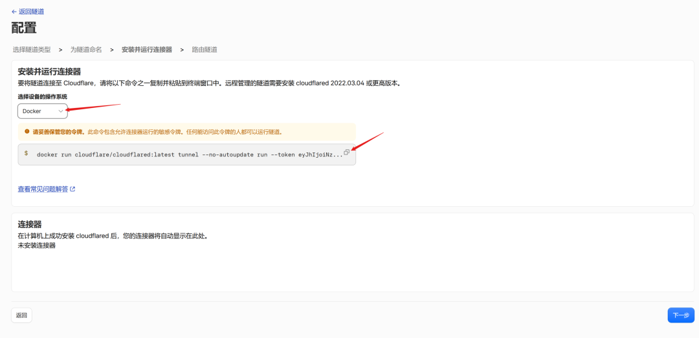

这里最重要的就是：

```
--token
```

后面的这一长串字符串就是这个 Tunnel 的认证 Token。

**不要把自己的真实 Token 泄露出去。**

因为这个 Token 相当于：

🗝️ 让 cloudflared 加入这个 Tunnel 的凭据。

后面我们在 N1 上运行 Docker 时，就会用到它：

```
docker run -d \
  --name cloudflare-tunnel \
  --restart unless-stopped \
  cloudflare/cloudflared:latest \
  tunnel --no-autoupdate run --token YOUR_TUNNEL_TOKEN
```


五、在N1上用Docker部署cloudflared 🐳

本文的 cloudflared 部署在：

```
192.168.0.203
```

这台 N1 上。

如果 N1 已经安装 Docker，直接运行：

```
docker run -d \
  --name cloudflare-tunnel \
  --restart unless-stopped \
  cloudflare/cloudflared:latest \
  tunnel --no-autoupdate run --token YOUR_TUNNEL_TOKEN
```

```
这个命令比cloudflare提供的多了几个参数，说明一下：
```

参数作用-d**后台运行**（Detach mode），不会占用你的终端窗口--name cloudflare-tunnel给容器起个名字，方便后续管理（查看日志、停止、重启）--restart unless-stopped**关键参数**：Docker 意外退出时自动重启，系统重启后也会自动启动（除非你手动 stop 过）--no-autoupdate禁止 cloudflared 自动更新，避免更新导致隧道中断（由 Docker 镜像更新更可控）

其中：

```
YOUR_TUNNEL_TOKEN
```

替换成 Cloudflare 后台创建 Tunnel 后获得的 Token。

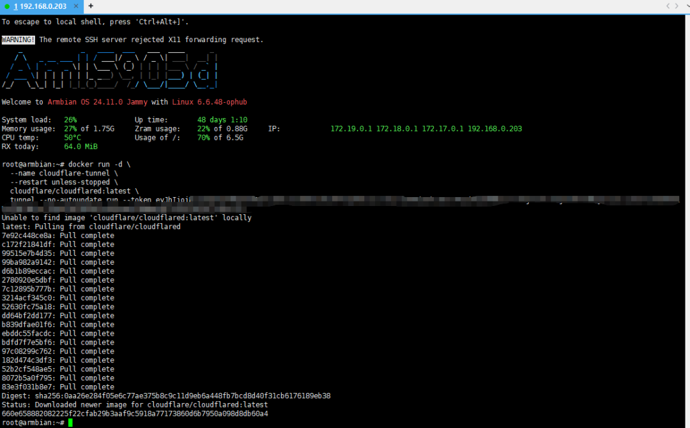

⚠️ 注意：

**真实 Token 不要泄露。**

文章示例中建议统一使用：

```
YOUR_TUNNEL_TOKEN
```

代替，实际部署时，请自行替换成你的token。

如果真实 Token 已经泄露，则应该及时处理对应 Tunnel 凭据。


六、Cloudflare Tunnel并不是“端口映射” 🔌

运行上面的 Docker 命令后，你可能会发现：

```
docker ps
```

并没有看到类似：

```
-p 80:80
-p 443:443
-p 5140:5140
```

这是正常的。

因为 cloudflared 并不是等待公网连接进来。

而是：

```
N1
192.168.0.203
    │
    │ 主动连接
    ▼
Cloudflare
```

所以家庭网络侧不需要为了 Cloudflare Tunnel 再开一个公网端口。

这也是：

**Cloudflare Tunnel ≠ 传统端口映射**

最核心的区别。


七、把公网域名指向路由器上的rtp2httpd 📺

docker部署完成之后，回到 Cloudflare 后台继续配置 Tunnel。

假设我们准备使用：

```
tv.example.com
```

作为 IPTV 的公网域名。

在 Tunnel 中添加一个“已发布应用程序”。

主机名：

```
tv.example.com
```

服务：

```
http://192.168.0.1:4022
```

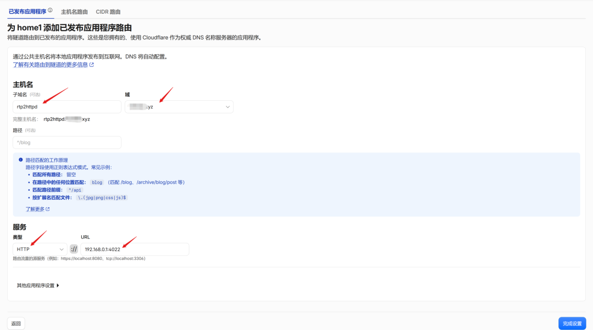

那么整个关系就是：

```
公网
https://tv.example.com
        │
        ▼
☁️ Cloudflare
        │
        ▼
🐳 N1
192.168.0.203
cloudflared
        │
        ▼
🏠 192.168.0.1
        │
        ▼
📺 rtp2httpd
```

注意这里有一个容易理解错的地方：

**Tunnel 跑在 N1 上，但 Tunnel 的目标服务可以是同一局域网中的另一台设备。**

这正是我们这个实际网络环境的特点。

配置完成后，先不要急着打开 IPTV 播放器。

直接访问：

```
https://tv.example.com/status
```

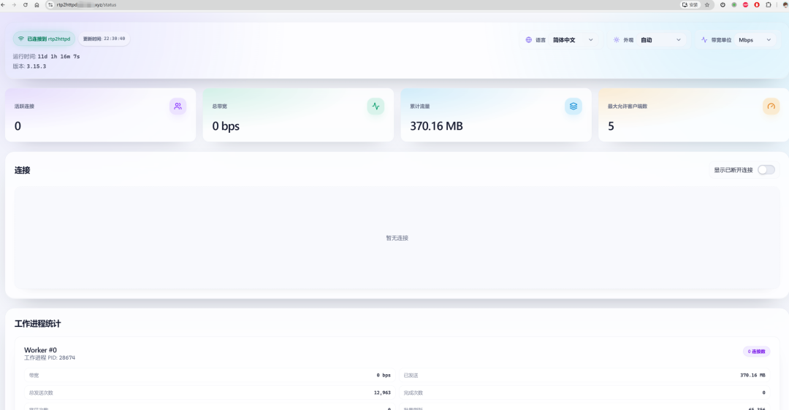

如果能够正常访问路由器上的 rtp2httpd 服务：

🎉 说明：

```
公网
 ↓
Cloudflare
 ↓
N1 cloudflared
 ↓
192.168.0.1
 ↓
rtp2httpd
```

整个链路已经打通。

接下来再测试具体 IPTV 频道。

至于 rtp2httpd 的频道地址、M3U 等具体配置，就不在这里重复介绍了。

需要注意，这个域名会暴露在公网，可能会被测绘网站收录，建议rth2httpd里设置r2h-token等措施，以限制他人非法访问。

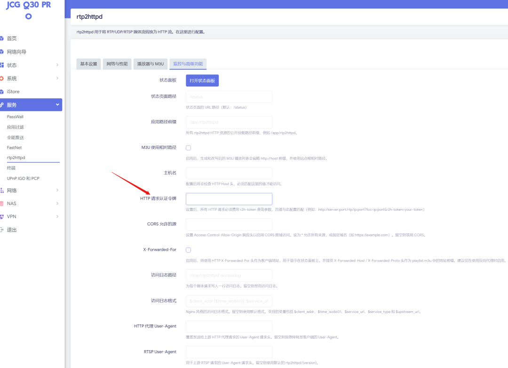

实测通过这个隧道观看1080p直播还算流畅，4K就不行了，会很卡。


毕竟cloudflare都是海外节点，想要速度快一些，可以尝试优选ip，不过Tunnel使用优选需要用到cloudflare SaaS，配置过程比较繁琐，有兴趣的可自行搜索相关教程。


八、真正有意思的地方来了：不只是IPTV 📺➡️🌐

如果做到这里，你可能会发现：

Cloudflare Tunnel 其实根本不关心你后面是什么服务。

它只需要知道：

```
公网域名
      ↓
内网 Service
```

所以除了：

```
tv.example.com
        ↓
192.168.0.1:4022
```

还可以继续添加其他服务。

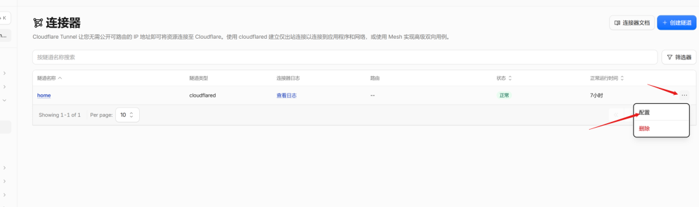

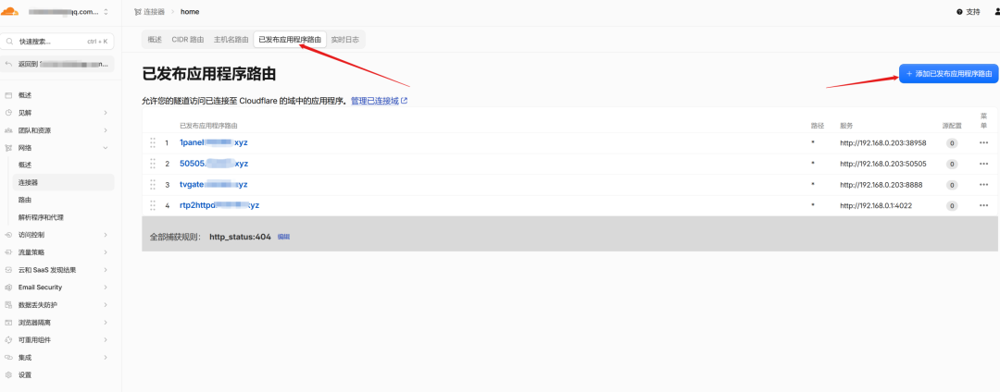

例如家里有：

```
TVGate
192.168.0.203:8888
```

那么可以配置：

```
gate.example.com
        ↓
192.168.0.203:8888
```

再比如：

```
1Panel
192.168.0.203:38598
```

可以配置：

```
panel.example.com
        ↓
192.168.0.203:38598
```

甚至还可以继续添加：

```
nas.example.com
        ↓
192.168.0.xxx:xxxx
```

```
home.example.com
        ↓
192.168.0.xxx:xxxx
```

```
iptv.example.com
        ↓
192.168.0.xxx:xxxx
```

于是，一个 Tunnel 就可以成为家庭内网服务的统一公网入口。🚀

最终可能形成这样的结构：

```
                       ☁️ Cloudflare
                              │
                       Cloudflare Tunnel
                              │
                     🐳 N1 192.168.0.203
                              │
          ┌───────────────────┼───────────────────┐
          │                   │                   │
          ▼                   ▼                   ▼
   tv.example.com      gate.example.com    panel.example.com
          │                   │                   │
          ▼                   ▼                   ▼
   192.168.0.1          TVGate服务             1Panel
   rtp2httpd
```

这时候 Cloudflare Tunnel 就不再只是：

“远程看 IPTV 的工具”

而变成了：

**家庭内网 Web 服务的统一入口。**

这也是我觉得这个方案最值得分享的地方。


九、几个容易踩的坑 ⚠️

## ① Tunnel部署在哪个设备不重要，关键是能访问目标服务

本文：

```
cloudflared
192.168.0.203
```

但目标：

```
rtp2httpd
192.168.0.1
```

完全没有问题。

只要：

```
192.168.0.203
        ↓
192.168.0.1:端口
```

网络是通的即可。

## ② 先测试内网，再测试公网

建议按照：

```
① IPTV组播正常
      ↓
② rtp2httpd局域网正常
      ↓
③ N1能访问rtp2httpd
      ↓
④ Tunnel连接正常
      ↓
⑤ 公网域名能打开
      ↓
⑥ 公网播放器测试
```

一步一步来。

## ③ Docker网络也要注意

如果 cloudflared 使用默认 Docker 网络，一般访问家庭局域网 IP 没问题。

但如果你对 Docker 网络做过特殊隔离、防火墙限制等，就需要确认：

```
cloudflared容器
        ↓
192.168.0.1
```

确实可以访问。


📌 总结

如果之前已经看过我们介绍 rtp2httpd 的文章，那么这次其实不用重新学习一套 IPTV 系统。

你只需要在原来的基础上，再增加一个：

```
🐳 cloudflared
```

即可。

最终：

```
             家庭局域网 🏠
                    │
       ┌────────────┴────────────┐
       │                         │
192.168.0.1                192.168.0.203
    路由器                       N1盒子
       │                         │
   rtp2httpd                Docker
       │                         │
       │                    cloudflared
       │                         │
       └───────────┬─────────────┘
                   │
                   ▼
             ☁️ Cloudflare
                   │
          ┌────────┼─────────┐
          │        │         │
          ▼        ▼         ▼
       IPTV域名   TVGate    1Panel
          │
          ▼
       📺 远程播放
```

所以，这个玩法真正有意思的地方并不是：

**“Cloudflare 可以远程看 IPTV。”**

而是：

**“只要家庭内网服务能够通过 HTTP/HTTPS 访问，就可以考虑利用 Cloudflare Tunnel 给它配置一个公网域名。”**

今天是：

📺 rtp2httpd

明天可能就是：

📡 TVGate

甚至：

🛠️ 1Panel

🏠 NAS

🖥️PHP Web

……

一个 N1，一个 Tunnel，就可以把家里的各种 Web 服务串起来。🌐✨

当然，管理后台类服务一定要做好身份认证和访问控制；同时，IPTV 相关内容也应确保属于自己有权访问和使用的范围，并遵守运营商服务协议、Cloudflare 服务条款以及当地法律法规。


**END**

