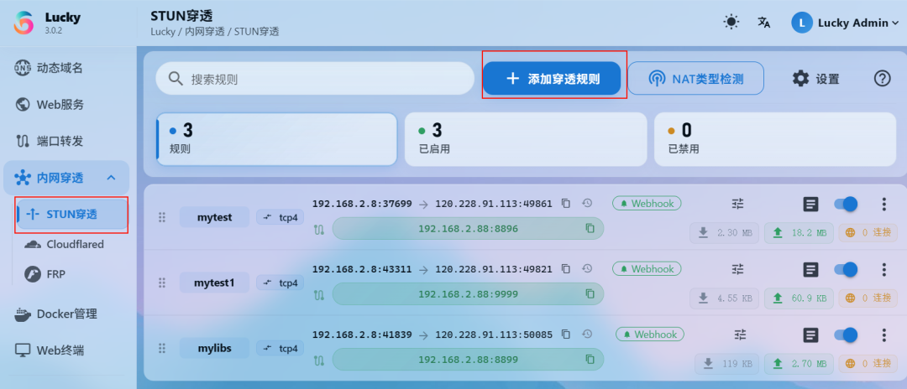
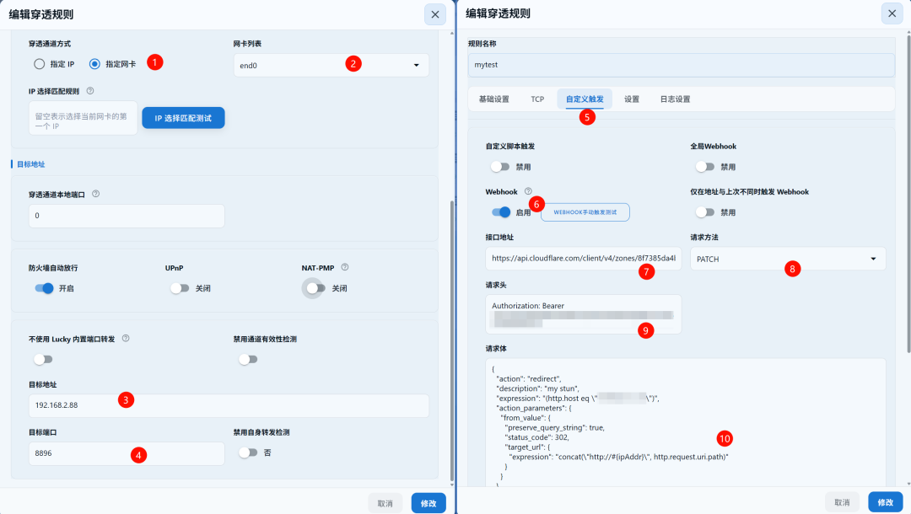
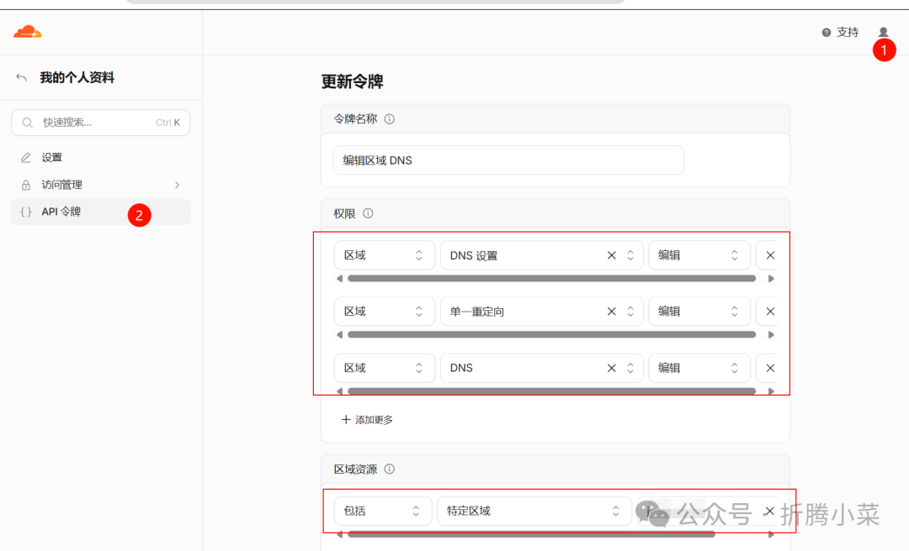
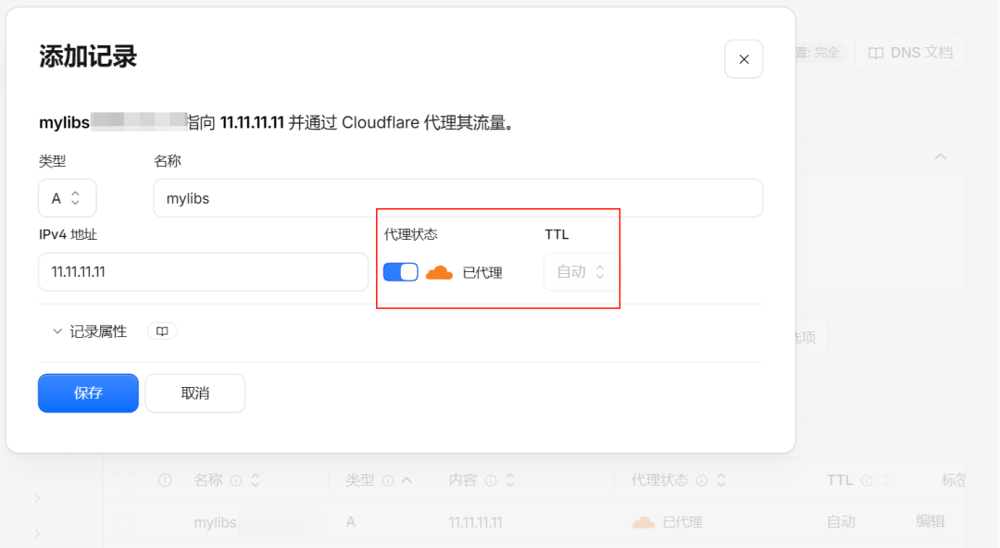
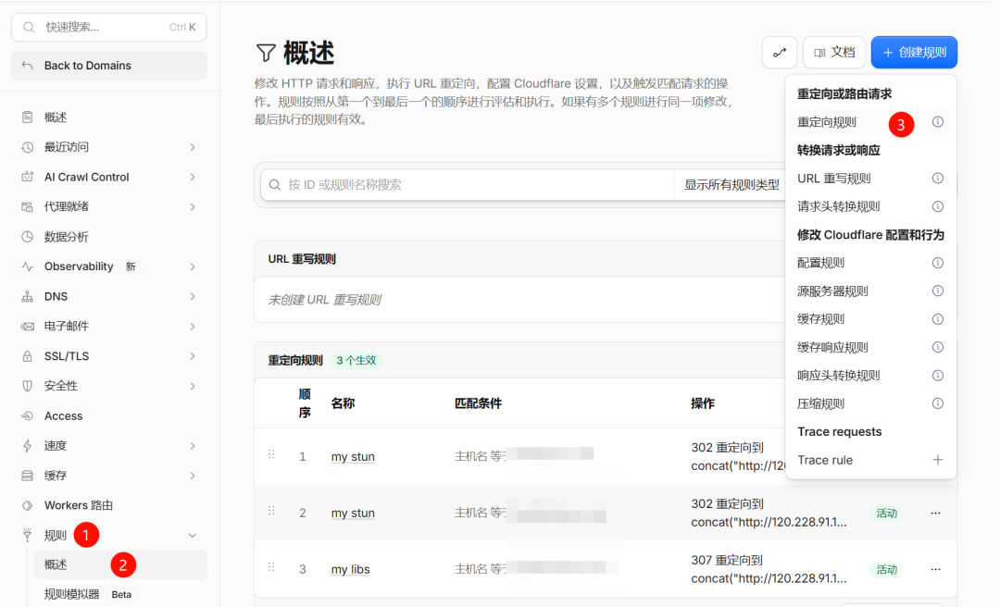
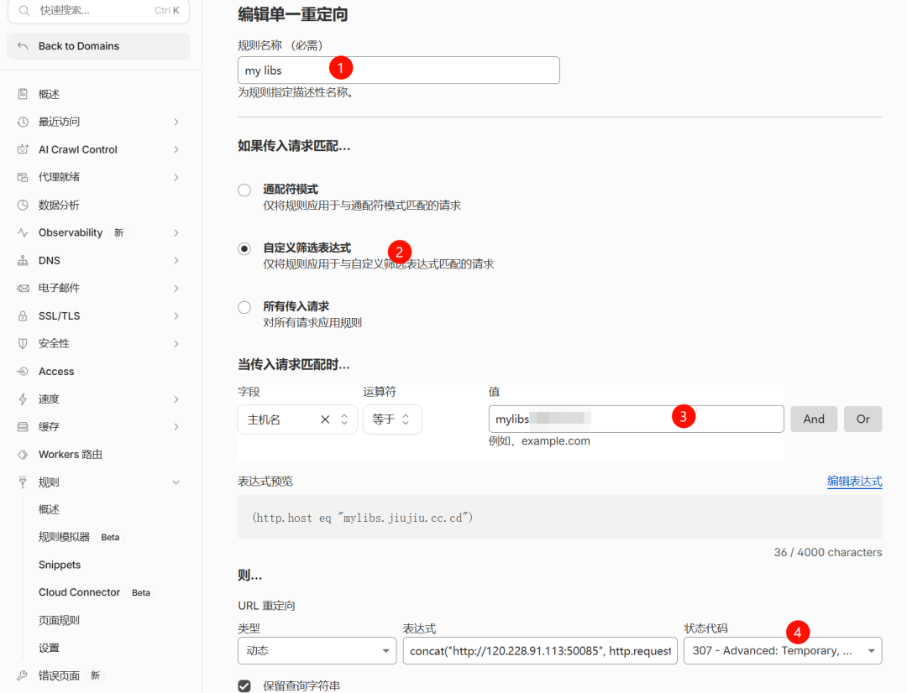
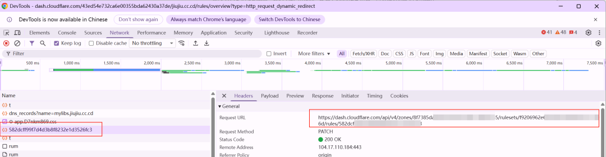

# 亲测有效：无需公网IP，轻松实现固定域名访问内网服务，榨干家宽带宽

> ✍️ **作者:** 折腾小菜  
> 📅 **发布时间:** 2026/10/8 07:08:00  
> 🔗 **微信原文:** https://mp.weixin.qq.com/s/FybjG7QJMdW6bUNC1sPxNw  
> 📦 **本地图片数:** 7 张 (已物理转存至本地 images/ 目录)

---

lucky硬核功能太多了，上一篇只介绍了怎么安装，以及一些安全配置，动态域名以及SSL证书。今天我们了解下STUN穿透，无需公网IP也能榨干家庭带宽。通过webhook自动绑定CF域名解析，以便通过域名固定访问地址。

特别是那些无法获取到公网IP以及不想折腾的友友们。

该方案有一定的局限性，不适合APP访问的服务。

此次主要了解下STUN穿透功能。

需要cloudflare和frp的朋友可以参考前期的文章

1. cloudflare

太强了！0 元实现 HTTPS 加密内网穿透，随时随地安全访问内网，保姆教程看完就会

2. frp

神马？没有公网IP？借朋友的就够了！（99%的人不知道），旧安装手机也能带你飞

3. STUN穿透

当然STUN穿透也有一定的局限性，以下为STUN的局限性及优势。

✅ 优点**轻量低耗**：协议简单，服务器只负责地址探测，不转发数据，开销极小**零配置**：无需改路由器、无需端口转发，开箱即用**P2P 直连**：能打通大多数 NAT，实现设备间直接通信，延迟低

## ❌ 局限

**对称 NAT 穿透失败**：NAT1,2大都可以，NAT3可能可以，NAT4有点困难**无中继能力**：只负责"问路"，打洞失败后无法兜底**依赖 UDP**：对 TCP 场景支持有限，严格防火墙下也可能被拦截

配置STUN穿透规则及webhook更新重定向规则
如果想知道当前网络NAT类型，也可以点击NAT类型检测

点击STUN穿透，添加穿透规则。参数请参照后续文章获取方式。

获取CF API token
登录CF，点击右上角配置文件-API令牌，创建令牌，选择编辑区域的使用模板按钮。点击保存并记录token，需要填入步骤⑨。

新增DNS记录
后续webhook更新并绑定到该子域名，填入步骤⑩，通过子域名重定向

创建重定向规则以及URL
新增重定向规则

点击编辑重定向规则，点击保存前，打开（F12）开发者模式，获取规则地址。需要把前缀https://dash.cloudflare.com/api/v4/修改为https://api.cloudflare.com/client/v4/即

https://api.cloudflare.com/client/v4/zones/8f738aaaaaaaaaa/rulesets/f92069aaaaaaaaaa/rules/164de93aaaaaaaaaa，需要填入步骤⑦

请求方式：PATCH
编辑穿透规则

Authorization: Bearer 替换为CFToken

{

  "action": "redirect",

  "description": "my stun",

  "expression": "(http.host eq \"子域名记录\")",

  "action_parameters": {

    "from_value": {

      "preserve_query_string": true,

      "status_code": 307,

      "target_url": {

        "expression": "concat(\"http://#{ipAddr}\", http.request.uri.path)"

      }

    }

  }

}

往期精彩
我的飞牛NAS活了：部署QwenPaw，让AI帮我管日常琐事
等了很久，湖南移动终是给公网 IPv6 了，外部直接访问内网服务
手机刷 Ubuntu Touch当服务器，电池成了最大的坑

摄像头云存储太贵？家用NAS实现7 天滚动自由，一年省个 VIP

亲测有效！硬核改造，旧手机秒变Ubuntu Touch系统，低成本搭建个人Linux服务器，Docker服务器

如果这篇内容刚好帮到你，建议先**点个收藏**，避免以后用的时候找不到。如果你也在折腾这些实用的小工具，欢迎**关注「折腾小菜」**，后面会持续更新：
👉 不花钱也能用的方案👉 普通人也能上手的教程👉 真正能提升效率的小技巧
有问题也可以后台留言，我都会尽量回复。你的每一次点赞和在看，都是我继续更新的动力 🙌

💡 **免责声明：**
**本文内容仅供个人学习与技术研究使用，不得用于任何商业用途或非法用途。相关部署与使用请遵守当地法律法规及平台规则。**

