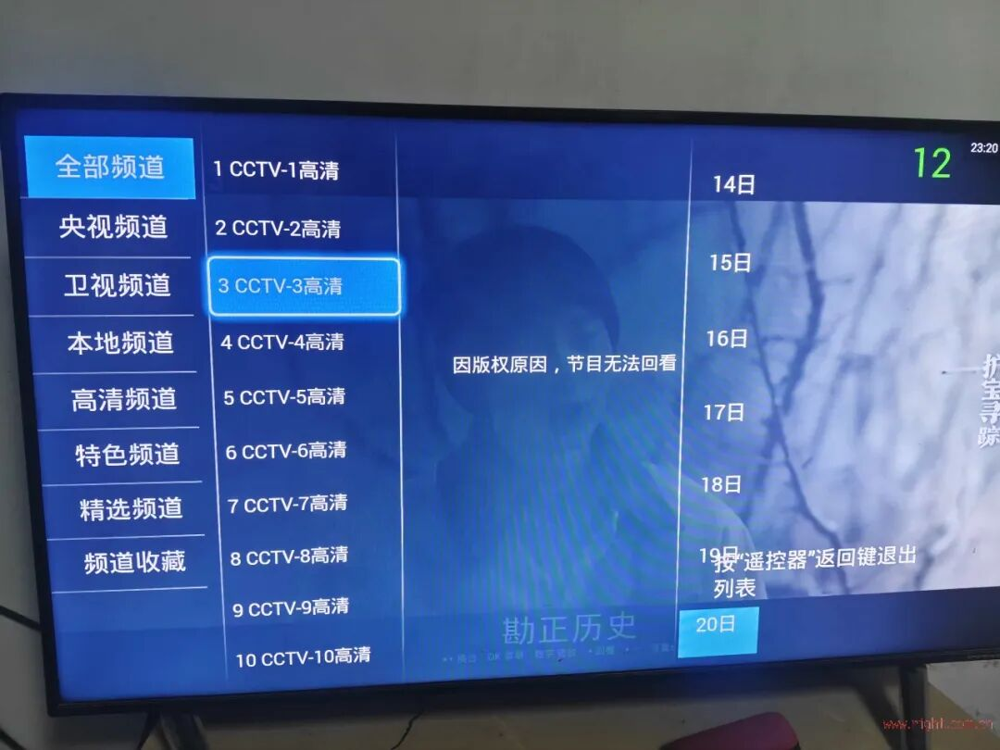
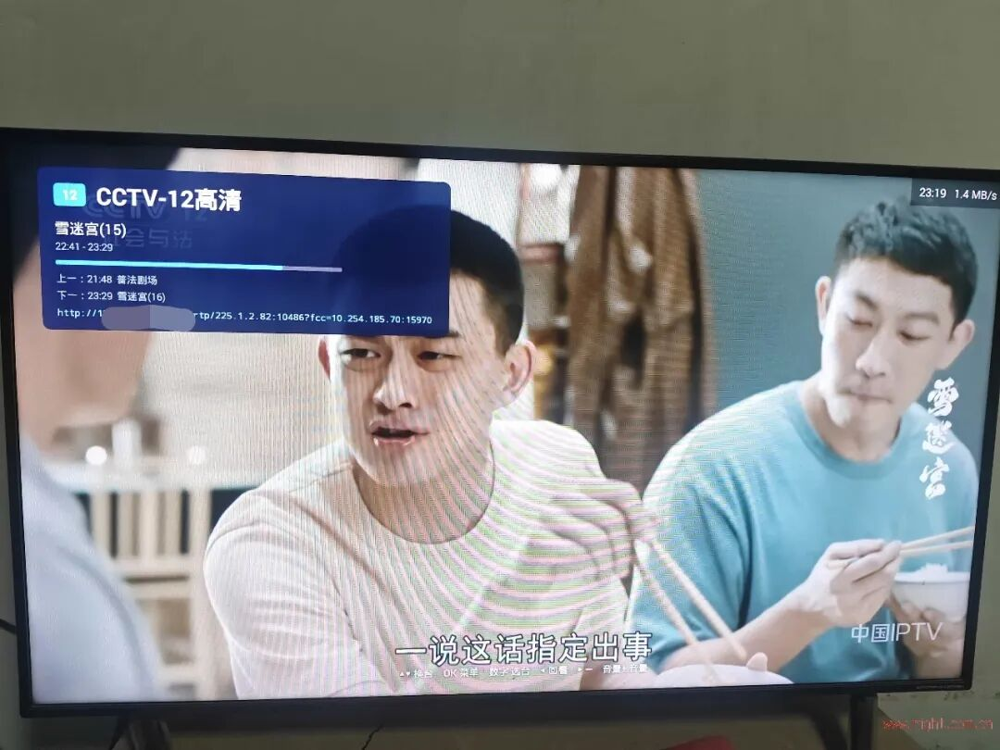
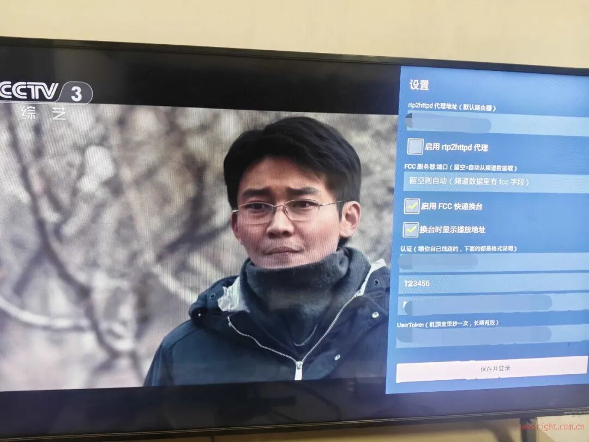

# 不用机顶盒也能看联通 IPTV？一套基于 rtp2httpd 的 Android TV 方案分享

> ✍️ **作者:**   
> 📅 **发布时间:** 2026/10/8 16:00:00  
> 🔗 **微信原文:** https://mp.weixin.qq.com/s/jsPLb38W3CjmBr07xep-uw  
> 📦 **本地图片数:** 40 张 (已物理转存至本地 images/ 目录)

---


📺前言

很多 IPTV 玩家折腾到最后，都会遇到一个问题：

**运营商送的机顶盒太封闭，自己又想用电视、投影或者 Android TV 设备直接看运营商 IPTV，到底能不能做到？**

最近看到恩山网友分享了一套比较有意思的方案：针对**河南联通 IPTV**环境，开发了一个 Android TV 客户端，不再依赖运营商原装机顶盒，而是直接在 Android TV 上模拟机顶盒的主要工作流程。

它并不是简单做一个 IPTV 播放器，而是从运营商认证、频道表获取，到直播地址、回看、时移以及快速换台，都尽量按照原来的 IPTV 体系来实现。

本文主要是对网友原帖及项目说明进行整理分享，方便对这类方案感兴趣的朋友了解它的实现思路。

⚠️ **说明：本文为网友方案整理分享，非本人原创开发。**

文中涉及的 IPTV 账号、业务密码、STBID、UserToken、组播地址以及网络配置，均应仅用于**自己合法开通的 IPTV 业务和自己的设备**。不同地区、不同运营商甚至同一运营商不同批次线路，实际配置都可能不同，请勿直接照搬。

原贴地址：
河南联通直播回放用rtp2httpd代理仿机顶盒界面 https://www.right.com.cn/forum/forum.php?mod=viewthread&amp;tid=8490224&amp;fromuid=309178 (出处: 恩山无线论坛)

APP及文件下载请至原贴查看。


🛜 一、先说清楚：这套方案到底解决什么问题？

传统运营商 IPTV，大致可以理解成：

**光猫/运营商网络 → IPTV 网络 → 机顶盒 → 运营商门户 → 频道/节目 → 播放**

运营商机顶盒并不仅仅是一个播放器。

它还要完成：
IPTV 网络接入
用户认证
STB 身份认证
获取频道列表
获取节目单
获取直播播放地址
获取回看/时移信息
与运营商门户进行交互
最后才是把视频播放出来

网友开发的这个 App，思路就是：

**Android TV + IPTV 网络 + rtp2httpd + 运营商门户接口**

把原来由运营商机顶盒完成的一部分工作，搬到了 Android TV 上。

所以它和普通的 M3U 播放器并不是一个概念。

普通 IPTV 播放器通常只需要：

给我一个 m3u/m3u8 → 播放

而这个方案需要自己完成：

认证 → 获取频道 → 获取节目 → 获取播放地址 → 播放

这也是整个项目比较有意思的地方。








🌐 二、使用 App 之前，首先要把 IPTV 网络打通

这一点其实非常重要。

很多人看到“Android TV IPTV 客户端”，第一反应可能是：

下载 APK → 安装 → 输入账号 → 看电视。

实际上并不是这么简单。

因为运营商 IPTV 和普通互联网视频最大的区别之一，就是**IPTV 网络和互联网网络通常不是完全一样的**。

作者在后续说明中专门补充了这一部分前置配置，而且也是整个方案能够正常工作的基础。

## 🔌 方案一：电视/机顶盒直接连接光猫 IPTV 网络

作者实际环境中，IPTV 业务存在 MAC 绑定，因此首先需要在光猫上建立 IPTV DHCP VLAN，例如：

**IPTV DHCP VLAN 20**

然后根据实际环境修改 IPTV 接口的 MAC 地址。

作者给出的做法是通过 Telnet 修改光猫 IPTV 接口 MAC，之后重启光猫，使配置生效。

同时还需要配置 IPTV 相关静态路由，例如：

```
10.253.0.0
202.99.114.0
222.138.197.0
10.254.0.0
```

这些路由指向：

```
2_IPTV_R_VID_20
```

另外还需要开启 IGMP Proxy，作者的环境中对应：

**高级配置 → 日常应用 → IPTV → ****2_IPTV_R_VID_20**

并设置公网组播 VLAN 为：

```
20
```

这样，电视或者机顶盒直接接入光猫 IPTV 网络后，理论上就能够正常获取 IPTV 业务。

不过，如果准备让旁路设备、NAS、N1 或其他 Linux 设备运行 rtp2httpd，那么网络结构还要继续处理。

## 🛜 方案二：使用 OpenWrt/ImmortalWrt 路由器

如果希望让：

**电视 → 家庭局域网 → 路由器 → IPTV 网络**

这种方式工作，那么路由器就需要正确处理 IPTV 网络以及组播。

作者使用的是 ImmortalWrt。

网络结构大致可以理解为：

```
光猫
 ├── PPPoE → 互联网
 │
 └── IPTV DHCP → IPTV 内网
                  ↓
             路由器 IPTV 接口
                  ↓
             IGMP Proxy
                  ↓
                LAN
                  ↓
             Android TV
```

其中比较关键的一点是：

光猫 IPTV 侧通过 DHCP 获取 IPTV 私网地址，而路由器本身使用 PPPoE 拨号上网。

在 PPPoE 正常工作的基础上，再创建一个 DHCP 接口，让路由器从光猫 IPTV 网络获取内部地址。

然后安装并配置 omcproxy，将这个 IPTV DHCP 接口作为上游接口。

同时建议在：

```
br-lan
```

上开启：

**IGMP Snooping**

再把前面提到的 IPTV 私网路由添加到对应的 IPTV 接口。

作者实际环境中还遇到了 DNS 解析问题，因此增加了域名映射，例如：

```
stb.chinaunicom.com    → 10.254.203.241
iptvzu.shangdu.com     → 10.254.184.10
iptvzn.shangdu.com     → 10.254.188.136
iptvz.shangdu.com      → 10.253.76.18
```

这样配置以后，电视就可以通过路由器连接 IPTV。

📌 **这里一定要特别提醒：**

上面这些 VLAN、IP、路由、域名以及 MAC 配置，都是作者实际线路环境中的参数。

**并不意味着所有河南联通用户都一样，更不能直接认为全国联通 IPTV 都能照抄。**

如果你自己的 IPTV 网络结构不同，首先应该确认：
光猫 IPTV 是 DHCP 还是 PPPoE
是否存在 VLAN
是否有 MAC 绑定
IPTV 地址段是什么
组播 VLAN 是多少
是否需要 IGMP Proxy
是否需要静态路由
IPTV DNS 是否独立

把这些基础网络问题解决以后，再折腾 App 才有意义。


🚀 三、为什么这里还需要 rtp2httpd？

这也是整个方案非常关键的一环。

运营商 IPTV 直播很多时候使用的是**组播 RTP**。

例如：

```
rtp://239.x.x.x:xxxx
```

这种地址在运营商 IPTV 网络内部可以正常使用，但普通 Android TV 播放器并不一定能够直接访问。

而 rtp2httpd 的作用，就是将：

**RTP/UDP 组播**

转换成：

**HTTP 单播**

可以简单理解成：

```
运营商 IPTV 组播
       ↓
   rtp2httpd
       ↓
HTTP 播放地址
       ↓
 Android TV
```

例如 App 最终访问的形式类似：

```
http://192.168.x.x:5140/rtp/239.x.x.x:xxxx
```

Android TV 不需要自己处理复杂的 IPTV 组播环境，只需要播放 HTTP 地址即可。

这也是为什么作者的方案并不是“单独安装一个 APK 就结束”，而是需要：

**IPTV 网络 + 组播转 HTTP + Android TV App**

三者配合。

如果 rtp2httpd 没有正常运行，那么即使 App 已经成功登录、频道表也已经出来了，真正播放的时候仍然可能是黑屏。


🔐 四、第一次使用 App，需要准备哪些信息？

网络打通以后，才轮到 App 本身。

这个 App 不是普通播放器，因此第一次使用需要准备四项信息：
参数
作用
IPTV 用户 ID
运营商 IPTV 账号，作者环境为 14 位
业务密码
IPTV 业务密码
STBID
原机顶盒的 32 位十六进制设备标识
UserToken
原机顶盒获取到的 32 位 Token

其中最麻烦的通常是：

**UserToken。**

因为它并不是简单通过账号密码就能得到。

作者在分析运营商认证流程时发现：

getencrypttoken.jsp

返回的主要是挑战串，并不会直接给出最终的 UserToken。

而在后续：

```
auth.jsp
getuserinfo.jsp
```

中，X-Frame-UserToken 也可能为空。

这就出现了一个非常有意思的现象：

**账号认证看起来已经成功，但是频道列表却是 0。**

因此如果出现：

登录成功，但是没有任何频道

除了检查网络之外，首先就应该检查 UserToken 是否正确。


🔑 五、UserToken 从哪里来？

作者给出了两种方式。

第一种，如果自己的机顶盒允许通过 ADB 访问，可以读取：

```
/data/local/DeviceInfo.ini
```

里面查找：

```
UserToken=
```

第二种，则是作者提供的 Windows PowerShell 抓包脚本，通过原机顶盒实际运行过程中产生的数据来获取相关信息。

这里还是要强调：

**这些信息应该只从自己的合法 IPTV 设备中获取。**

它本质上是为了让自己的 Android TV 客户端能够复现自己原有机顶盒的认证身份，而不是用于获取其他人的账号或者绕过运营商业务权限。


📄 六、还提供了配置文件，可以省掉手动输入

如果直接在电视遥控器上输入几十位甚至上百位字符，确实挺痛苦。

因此项目还提供了：

```
iptv.cfg
```

配置文件。

格式非常简单：

```
# 以 # 开头的行是注释
userId=你的14位账号
password=你的密码
stbId=你的32位序列号
userToken=你的32位令牌
```

然后通过 ADB：

```
adb push iptv.cfg /sdcard/iptv.cfg
```

推送到电视。

App 第一次启动的时候即可导入。

对于 STBID、UserToken 这种很容易把 l、1、I 等字符搞混的长字符串来说，这种方式还是方便很多。


📺 七、认证成功以后，它到底能做什么？

认证成功并不是最终目的。

真正有意思的是后面的 IPTV 门户流程。

作者实际上是在尽量复现运营商机顶盒的工作方式：

```
启动 App
  ↓
获取挑战串
  ↓
完成认证
  ↓
进入运营商门户
  ↓
获取频道表
  ↓
获取节目/页面信息
  ↓
获取直播地址
  ↓
rtp2httpd 转换
  ↓
Android TV 播放
```

因此它能够实现的不只是简单直播。

目前主要功能包括：

## 📡 直播

通过运营商提供的频道信息获取直播地址，再通过 rtp2httpd 播放组播。

## ⚡ FCC 快速换台

如果线路提供 FCC 服务，可以实现更快的频道切换。

设置里面可以开启：

**FCC 快速换台**

FCC 服务器留空时可以自动获取。

## ⏪ 时移

播放过程中可以进入时移。

支持：
左右键 ±30 秒
OK 暂停
返回回到直播
长按右键追赶直播进度

## 🔄 回看

对于运营商提供回看能力的频道，可以直接从节目列表进入回看。

## 📺 运营商频道页面

它并不是自己维护一份 M3U。

频道号、频道名称以及节目页面尽可能跟随运营商平台。

所以它更接近：

**“把机顶盒搬到 Android TV 上”**

而不是：

**“再做一个 IPTV 播放器”。**


🧩 八、项目里面比较有意思的技术实现

这个项目最值得研究的其实不是 APK 界面，而是作者对运营商 IPTV 门户流程的分析。

例如认证过程中会涉及挑战串以及加密计算。

作者分析出的认证逻辑大致是：

```
rand = md5(挑战串)
```

然后取前 8 位，对其中的 a-f 做特定映射，最后组成认证数据：

```
rand$挑战串$UserID$STBID$本机IP$MAC$$CTC
```

再经过：

**3DES-ECB + PKCS#5**

加密，最终转换为大写十六进制。

也就是说，App 并不是简单地：

```
POST 用户名
POST 密码
```

而是在模拟运营商机顶盒的认证逻辑。

门户流程也比较有意思：

```
funcportalauth.jsp
        ↓
frame.jsp
        ↓
frameset_judger.jsp
        ↓
frameset_builder.jsp
```

作者发现一个比较特殊的现象：

**频道表只会在一个会话的第一次 ****frameset_builder**** 中完整返回。**

后面再次刷新可能直接变成 0。

这也解释了为什么 App 不能简单地：

每次频道刷新 → 再请求一次页面

而是需要在必要的时候重新完成整套认证流程。


🔄 九、频道表还能自动维护，这一点挺实用

运营商 IPTV 频道并不是永远不变的。

可能出现：
新增频道
下架频道
频道改号
频道改名

如果 App 固定保存一份频道列表，时间久了肯定会出现问题。

所以作者做了一个自动维护机制。

App 启动后大约 9 秒，会自动进行一次完整认证并刷新频道表。

日志可能出现：

```
频道表刷新开始（启动自检）
```

如果没有变化：

```
结构无变化，共131个...
```

如果有变化，则会记录：

```
新增2
下架1
改号0
改名3
```

这样就不需要每次频道调整以后重新安装 APK。

更细节的一点是：

**它保存的不是“上次播放第几个频道”，而是频道身份。**

例如：

```
上次看：湖南卫视
```

即使运营商调整了频道顺序，只要湖南卫视仍然存在，它依然可以找到对应频道。

如果原频道已经下架，则自动从第一个频道开始。

另外，作者还处理了一个电视端很容易出现的问题：

**频道页面的光标和实际播放频道错位。**

也就是说，界面高亮的是 A，真正播放的却是 B。

项目通过页面游标重新校准，避免这种情况。


🎮 十、电视遥控器怎么操作？

这个 App 明显是按照 Android TV 场景设计的，而不是手机 App。

## 📺 直播状态

↑ / ↓：上下换台
数字键：输入频道号
输入 2 秒后自动跳转
OK：打开频道栏
← / →：进入时移
音量键：调节音量
Menu：打开设置
连续按两次返回：退出 App

## 📋 频道栏

↑ / ↓：上下移动频道
←：切换分类
→：节目列表
OK：播放/进入回看
返回：关闭频道栏

## ⏪ 时移/回看

← / →：±30 秒
OK：暂停
返回：回到直播
长按右键：快速追赶直播

另外还定义了四色按键：

```
红色：直播
绿色：回看
黄色：首页
蓝色：我的
```

如果电视遥控器支持四色按键，操作起来会比较接近传统机顶盒。


⚙️ 十一、设置里面有哪些功能？

App 设置比较简单，主要包括：

## 🌐 rtp2httpd 地址

默认代理端口：

```
5140
```

例如：

```
http://路由器IP:5140
```

如果 rtp2httpd 就运行在路由器上，那么填写路由器局域网地址即可。

## ⚡ FCC

可以开启/关闭快速换台。

FCC 服务器可以留空，让程序自动获取。

## 🔗 播放地址显示

可以打开：

**显示播放 URL**

方便折腾 IPTV 的朋友调试。

## 🔐 认证信息

就是前面提到的：

```
UserID
Password
STBID
UserToken
```

修改以后立即生效，并且会保存。


🖥️ 十二、为什么不同电视分辨率，界面也能正常显示？

作者的 UI 设计基准是：

```
1280 × 720
```

然后根据实际屏幕进行缩放。

例如：

```
1280 × 720   → 1.0
1920 × 1080  → 1.5
2560 × 1440  → 2.0
3840 × 2160  → 3.0
```

这种方式并不依赖 Android 系统 DPI 设置。

对于电视盒子、电视、投影等不同 Android TV 设备来说，确实比单纯写死一个尺寸更加可靠。


🛠️ 十三、遇到问题怎么排查？

这个项目的故障基本可以按照“网络 → 认证 → 频道 → 播放”的顺序排查。

## ❌ 黑屏

首先检查：

```
IPTV 组播是否正常
        ↓
IGMP Proxy 是否正常
        ↓
rtp2httpd 是否运行
        ↓
5140 端口是否可以访问
```

如果频道列表正常，但所有频道都黑屏，那么优先检查 rtp2httpd 和组播链路。

## ❌ 登录成功，但没有频道

重点检查：

**UserToken。**

这是作者特别强调的一点。

认证看起来成功，并不代表频道表一定能够正常获取。

## ❌ 提示“暂无此频道”

这种情况不一定是 App 的问题。

运营商页面可能存在某个频道，但你自己的 IPTV 线路并没有实际提供对应播放地址。

## ❌ 没有 EPG

项目并不是自己建立一套完整 EPG 数据库。

如果运营商本身没有给某个频道提供 EPG，那么 App 也不会凭空生成。

## ❌ 回看不可用

可能是运营商后台节目数据存在延迟。

这种情况下可以尝试返回上一个已经生成回看数据的节目。

## ❌ 换台比较慢

确认 FCC 是否开启。

同时检查线路本身是否提供 FCC 服务。

## ❌ 播放过程中突然退回桌面

部分电视自带播放器会抢前台焦点。

项目对此进行了处理，会尝试重新把 App 拉回前台。

## ❌ 怎么退出？

连续按两次返回键。


🔍 十四、还有一个容易误解的问题：页面有频道，不代表你的线路一定能播

作者在实际测试中发现了一个很典型的情况。

例如页面上可能存在：

```
606 湖南卫视4K
```

但是从真正的权威频道表来看，并没有这个频道的播放地址。

进一步请求：

```
channel_play.jsp?mixno=606
```

拿到的可能只是一个中间件控制页面，而不是实际的视频播放地址。

这意味着：

**运营商页面“显示了这个频道” ≠ 你的 IPTV 线路“真的提供这个频道”。**

所以如果遇到某个频道：

页面有，但是播放不了

不要第一时间认为 App 有 Bug。

原装机顶盒如果在同一条线路上也无法播放，那么很可能就是运营商线路本身没有给这个频道提供播放地址。


📝 十五、如果想调试，可以直接看 ADB 日志

作者也提供了日志查看方式：

```
adb connect <电视IP>:5555
```

然后：

```
adb logcat -s IPTVWEB:I
```

里面可以看到类似：

```
频道表刷新开始（启动自检）
```

或者：

```
结构无变化，共131个...
```

也可能看到：

```
新增2/下架1/改号0/改名3
```

换台时则可以看到：

```
PROBE 换台页 mixno=...
地址特征: 无
```

以及最终的播放 URL 等信息。

对于排查：

**到底是认证失败、频道没有地址，还是 rtp2httpd 播放失败**

非常有帮助。


💡 十八、总结：它真正有意思的地方在哪里？

如果单纯从“能不能看电视”来说，这个项目其实并没有什么神奇之处。

因为现在 Android TV 上能播放 IPTV 的软件非常多。

真正值得研究的是它的思路：

**它不是自己维护一套直播源，而是在尽量复现运营商原有的 IPTV 机顶盒工作流程。**

整个方案可以概括成：

```
合法开通的 IPTV 业务
        ↓
   IPTV 网络打通
        ↓
     IGMP/组播
        ↓
    rtp2httpd
        ↓
  Android TV App
        ↓
    运营商认证
        ↓
    获取频道表
        ↓
    获取播放地址
        ↓
直播 / FCC / 时移 / 回看
```

这样做的一个好处就是：

**运营商频道发生变化时，不需要自己重新找 M3U、改频道号、换播放地址。**

只要运营商的接口和业务流程没有发生重大变化，App 就可以重新认证并自动同步频道表。

对于 IPTV 玩家来说，这种思路其实比单纯收集一堆直播源更值得研究。

它也让我们重新认识了 IPTV：

IPTV 并不只是“一堆组播地址”。

在真正的运营商 IPTV 系统里，背后还包括：

**网络接入、组播、认证、门户、中间件、频道表、节目单、回看、时移、FCC 以及终端设备。**

而这个项目做的事情，就是把其中原本藏在运营商机顶盒里的部分流程，一点一点搬到了 Android TV 上。


⚠️ 最后提醒

本文仅作为 IPTV 技术研究、网络配置和项目分享。

不同地区运营商的 IPTV 网络、VLAN、认证方式、接口地址和业务权限差异很大，**河南联通的配置并不代表其他地区也能使用**。

尤其是账号、密码、STBID、UserToken 等信息，都属于用户自己的业务数据，请务必仅用于自己合法开通的 IPTV 服务。

如果你的目标只是让家里的电视观看自己已经开通的运营商 IPTV，那么这种“**保留运营商业务体系 + 自己解决终端和网络问题**”的思路，确实值得 IPTV 玩家研究一下。

📡 对 IPTV 玩家来说，真正有意思的往往不是“找一个能播放的源”，而是搞明白：

**这个源到底从哪里来、网络怎么走、机顶盒到底做了什么，以及我们能不能用自己的设备把整个链路重新跑起来。**


**END**

